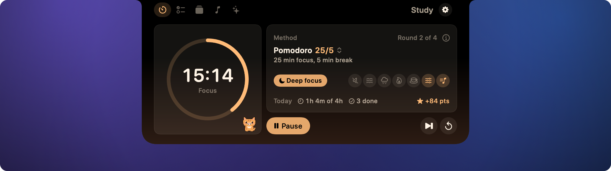
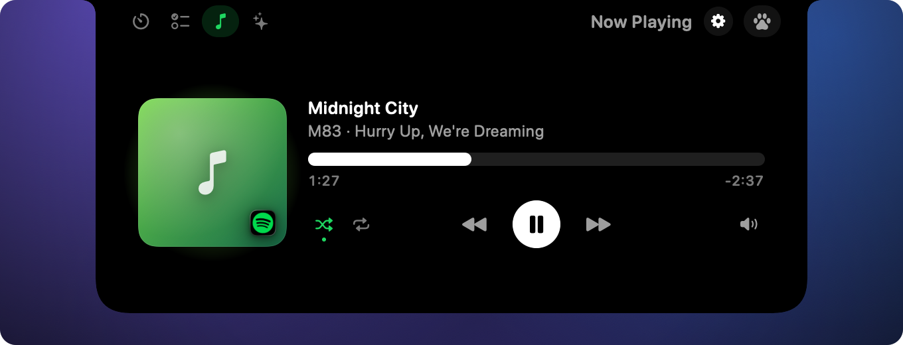
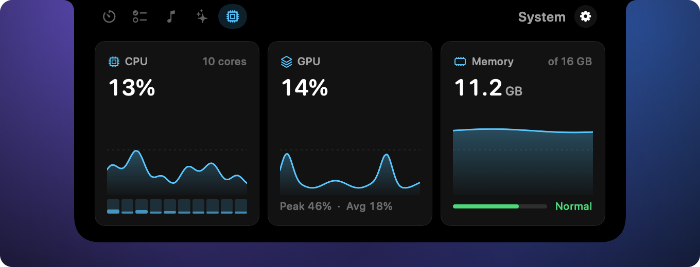
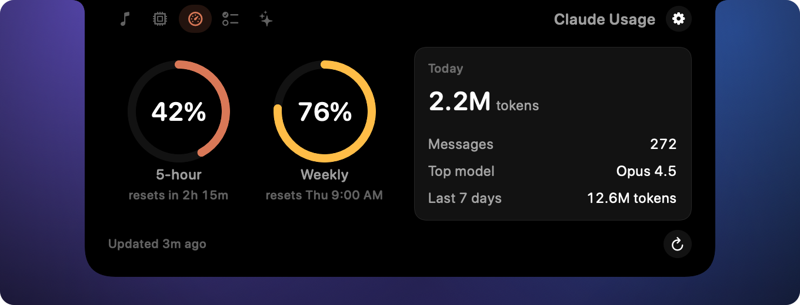
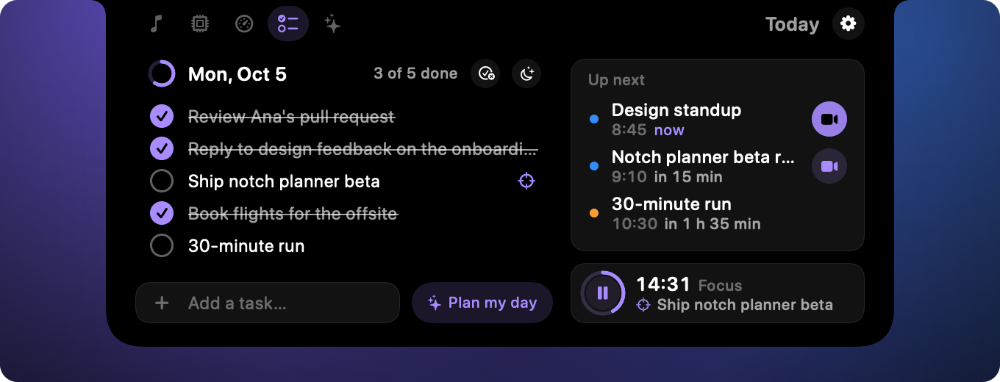
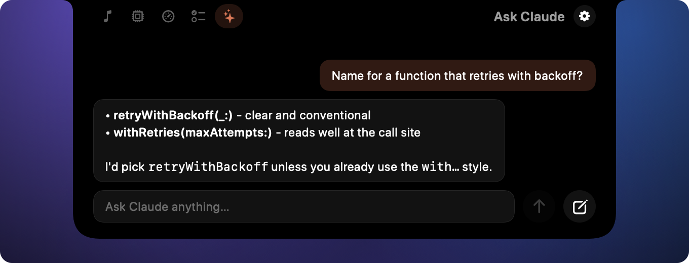

<p align="center">
  
</p>

<h1 align="center">Tabbi</h1>

<p align="center">
  <strong>A cozy study and productivity companion: a cat in your notch.</strong>
  <br>
  Your day, a focus timer, Anki reviews, music and Claude, one click away, with a small pet keeping you company.
</p>

<p align="center">
  <a href="#install">Install</a> ·
  <a href="#features">Features</a> ·
  <a href="#build-from-source">Build from source</a> ·
  <a href="#permissions">Permissions</a> ·
  <a href="#privacy">Privacy</a> ·
  <a href="#faq">FAQ</a>
</p>

---

Tabbi is a small, native macOS app that lives in the notch.
Its name is a tabby cat plus the tabs it keeps for you.
Closed, it is invisible except for a quiet live activity beside the notch: your next meeting, the song playing, a focus timer, tasks left today, study goals left (such as Anki cards to review), or a Claude limit above 80%.
A meeting starting within 5 minutes stays put; otherwise the activities take turns every few seconds.
Right-click the notch and choose **Settings…** to pick which ones show, or turn the preview off.
Click it and the notch grows into a dark panel with the tabs of your kit.
Flip between them with a two-finger swipe, the arrow keys, the number keys 1-9 or the tab icons, and press Esc to close it again.

It is written in Swift with SwiftUI and AppKit, has no third-party dependencies, no account and no telemetry.

<p align="center">
  
</p>

## Features

### Now Playing

Album artwork, track, artist, a scrubbable progress bar, and play, skip, shuffle and repeat controls for Spotify and Apple Music.
While music plays, the closed notch shows the cover and a live equalizer.



### System

CPU, GPU and memory at a glance, with a short history so you can see spikes, sampled only while the panel is open.



### Claude Usage

Your 5-hour and weekly Claude limits, read through your own `claude` CLI, plus today's token and message totals from your local Claude Code transcripts.



### Today

A daily checklist that lives one click away, with progress for the day and quick add.
**Plan my day** asks your local `claude` CLI to fit your unfinished tasks, plus work your other tabs share (such as Anki reviews), into today's free calendar gaps, and adds the blocks you accept to your default calendar.
Study kits such as Med School plan on your Mac instead: review blocks early in the day, study blocks of the kit's study method length, and breaks around your events.
**Wrap up** shows what you finished, what carries over to tomorrow, your study time or focus sessions and goals such as cards reviewed, with a short summary from Claude.

While a focus timer runs, focus mode can play a locally generated focus sound (brown, pink or white noise, rain, fireplace or cafe murmur, blended up to three), start a playlist in Spotify or Apple Music, and turn on Do Not Disturb through two Shortcuts you create.
On a break or when you stop, the sound fades out, a playlist it started is paused and Do Not Disturb is turned off again.
Set it up in **Settings > Focus**, which includes a short guide for the shortcuts and Test buttons.
Prefer a timer without the checklist? Add the **Focus** tab from **Add More** in **Settings > Modules**: the same timer, large, with focus mode at a glance.



### Ask Claude

A quick question box that streams answers from your local `claude` CLI, with Markdown rendering and follow-up questions.



### Study tabs

Study is one of the Essentials tabs, and the Med School kit adds Anki; Party and Closet are one click away in the **Add More** library in **Settings > Modules**.
**Study** runs a session in the study method you pick (Pomodoro, deep focus blocks and more) and counts today's minutes and points.
**Anki** shows the cards due in your decks through the AnkiConnect add-on on your Mac.
**Party** lets friends study together and see who is focusing, through an optional friends server.
**Closet** is your study pet's home: pick a cat or a dog, recolor it and dress it up with what your study points unlock.
The pet lives beside the notch and, if you turn on its coach, nudges you back when you drift off.

### Kits

A kit is a premade set of tabs for one kind of user.
Tabbi ships Essentials (a timer, your to-do list, music and Claude; the default) and Med School (Essentials plus Anki), and you can switch kits, reset to a kit's defaults, or import a kit someone shared in **Settings > Modules**.
Kits are small JSON files; [docs/kits.md](docs/kits.md) explains how to write your own.
See [docs/ROADMAP.md](docs/ROADMAP.md) for where Tabbi is going next.

## Install

1. Download `Tabbi-<version>.dmg` from the [latest release](https://github.com/ethanwchen/notchdeck/releases/latest).
2. Open it and drag **Tabbi** onto the **Applications** folder.
3. Open Tabbi from Applications, then click the notch.

Tabbi is signed and notarized, so macOS opens it without any workaround, and it keeps itself up to date.
It has no Dock icon and no menu bar item; to quit, right-click the notch and choose **Quit Tabbi**.
[docs/install.md](docs/install.md) walks through each step with pictures and covers Homebrew, updates, troubleshooting and uninstalling.

## Requirements

- macOS 14 Sonoma or later, on Apple silicon or Intel.
- A MacBook with a notch for the full experience. Other displays get a virtual notch at the top center of the screen (see the [FAQ](#faq)).
- Spotify or Apple Music for Now Playing.
- [Claude Code](https://claude.com/claude-code) installed and signed in, for Claude Usage and Ask Claude.

## Build from source

You need Xcode 16 or later, or a Swift 6 toolchain, on macOS 14+.

```sh
git clone https://github.com/ethanwchen/notchdeck.git
cd notchdeck
scripts/run.sh                  # builds build/Tabbi.app (debug) and launches it
```

Other useful commands:

```sh
swift build                     # compile; must stay warning-free
swift test                      # unit tests for TabbiKitCore
TABBI_DEMO=1 swift run Tabbi --snapshot snapshots   # render every notch state to PNG with sample data
scripts/release.sh [--adhoc]    # universal, signed and notarized DMG and zip in build/release/
scripts/bundle.sh               # build/Tabbi.app
```

Editions are branded builds of the same binary, with their own name, bundle id, data folder and preselected kit.
Tabbi ships as a single edition, `tabbi`, and serves different audiences with kits; the mechanism stays for future branded builds.
An edition is one JSON file in `Sources/TabbiKitCore/Editions/BundledEditions/` (id, name, bundle id, default kit, an optional icon in `Resources/` and the Info.plist strings that name the app), which both the app and `scripts/assemble.sh` read, so a new edition needs no code change: `scripts/bundle.sh <id>` builds it.

`TABBI_DEMO=1` swaps every data source for realistic sample data, so you can try the UI without Spotify, a calendar or the `claude` CLI.

## Permissions

Tabbi asks for each permission only when the module that needs it is first used.
You can change any of them later in **System Settings > Privacy & Security**.

| Permission | Asked by | Why |
| --- | --- | --- |
| **Automation: Spotify** | Now Playing, focus mode | Read the current track and send play, pause, skip, seek, shuffle and repeat commands to Spotify through Apple Events, and start or pause a focus playlist. |
| **Automation: Music** | Now Playing, focus mode | The same for Apple Music. |
| **Calendars** | Today | Show your next events and their video call links, and add the Plan my day blocks you accept to your default calendar. Events are read on your Mac and never leave it. |
| **Notifications** | Today, Focus | Tell you when a focus timer ends while the notch is closed. |

Claude Usage and Ask Claude need no system permission.
They run the `claude` command that is already installed and signed in on your Mac.

## Privacy

- **No telemetry, no analytics, no account.** Tabbi does not phone home.
- **The only network requests it makes itself** are the ones its tabs need: album artwork URLs that Spotify provides, AnkiConnect on your own Mac for Anki, and the friends server for Party, only while that tab is on.
- **Update checks** download Tabbi's release feed from GitHub once a day; you can turn them off in **Settings > About**.
- **Claude features go only through your local `claude` CLI.** Tabbi never reads your Claude credentials or the keychain.
  Ask Claude sends your question to Claude through that CLI, exactly as if you had typed `claude -p` in a terminal.
  Plan my day sends today's remaining events, unfinished task titles and your other tabs' goals (such as "Anki reviews (320 cards left)") the same way, and Wrap up sends your task titles and today's study and goal figures, only when you press them.
- **Claude Usage** reads token counts from the transcripts in `~/.claude/projects`, read-only, and never writes there.
  Checking your limits sends a tiny request with the cheapest model, so it never runs until you press refresh once.
  After that, it runs when you press refresh or open the panel 10 or more minutes after the last check.
- **Your checklist and daily reviews** are stored locally in your user Library and nowhere else.

## FAQ

**Does it work on Macs without a notch?**
Yes.
On a display without a notch, Tabbi draws a virtual notch, a small black pill at the top center of the screen, that opens into the same panel.
It looks most at home on a notched MacBook, though.

**Why does it use the `claude` CLI instead of an API key?**
So Tabbi never has to handle your credentials.
The CLI is already signed in, already knows your plan and its limits, and keeps your Claude usage in one place.
It also means there is no API key to paste into a third-party app and no extra billing.

**Do I need Claude Code to use Tabbi?**
No.
Now Playing, System and Today work without it.
The two Claude panels show a short setup hint until the `claude` command is found.
In Today, Plan my day needs it (except in study kits, which plan on your Mac), and Wrap up falls back to a local summary line without it.

**How do I update or uninstall it?**
Tabbi updates itself; right-click the notch and choose **Check for Updates…** to check now.
To uninstall, quit it and drag it from Applications to the Trash; [docs/install.md](docs/install.md#uninstall) also lists where your data lives.

**How do I quit it?**
Right-click the notch and choose **Quit Tabbi**.

**Does it slow my Mac down?**
It is a small native app with no web views.
System sampling and Claude refreshes only run while their panel is open, and Now Playing only resyncs with the player every few seconds while you are looking at it.

## Contributing

Contributions are welcome.
Start with [CONTRIBUTING.md](CONTRIBUTING.md) for the dev setup and the snapshot workflow, and [AGENTS.md](AGENTS.md) for the architecture and design rules.
[docs/ROADMAP.md](docs/ROADMAP.md) lists planned kits, modules and content packs.
Please follow the [Code of Conduct](CODE_OF_CONDUCT.md), and report security issues privately as described in [SECURITY.md](SECURITY.md).
Notable changes are listed in [CHANGELOG.md](CHANGELOG.md).

## License

Tabbi is released under the [MIT License](LICENSE).
