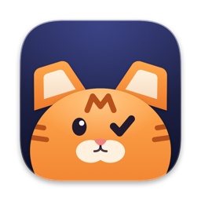
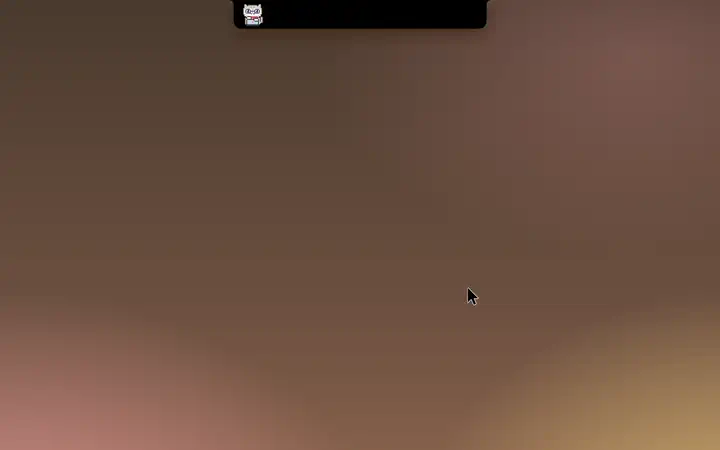
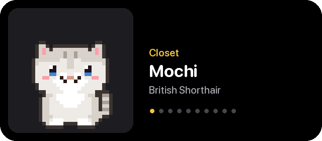
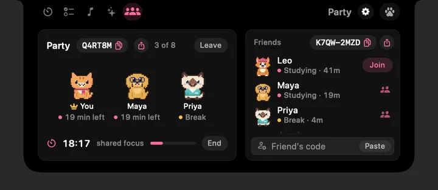
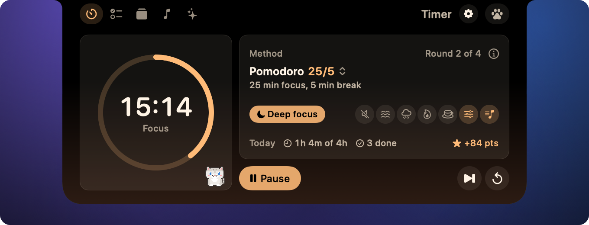
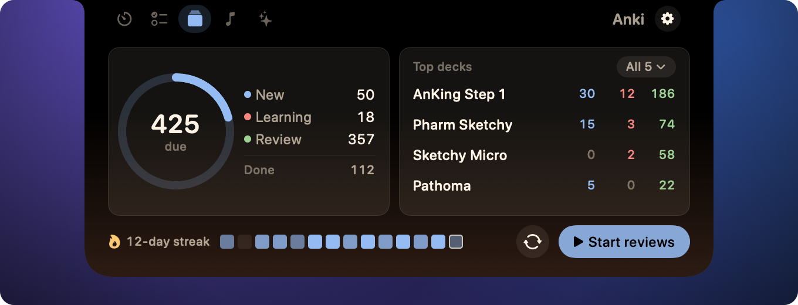
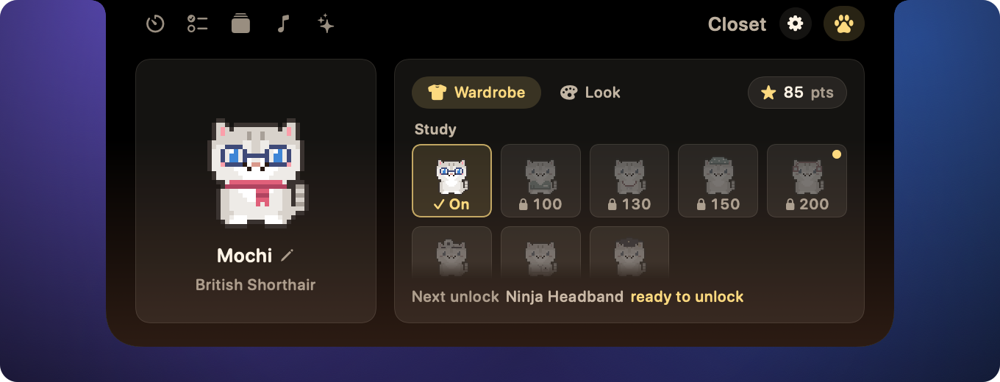
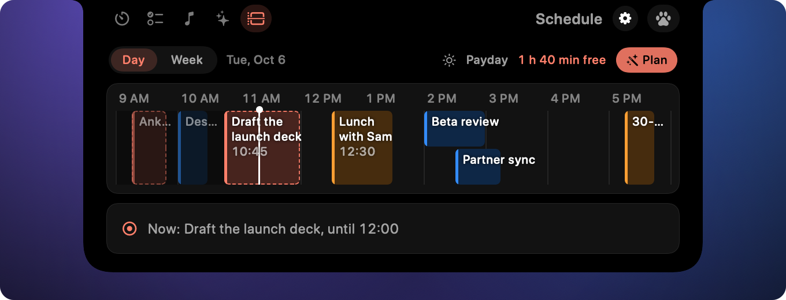
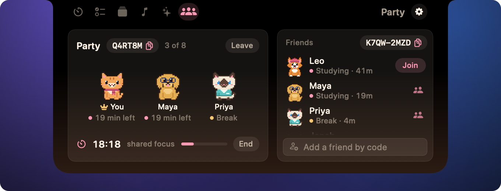

<p align="center">
  
</p>

<h1 align="center">Tabbi</h1>

<p align="center">
  <b>A little pet for your laptop notch.</b><br>
  A focus timer, your day, your music and a pixel cat that cheers you on, one click away.
</p>

<p align="center">
  <a href="https://tabbinotch.com"><b>tabbinotch.com</b></a>
</p>

<p align="center">
  <a href="https://tabbinotch.com"></a>
  <a href="https://buymeacoffee.com/ethanpolar"></a>
</p>

<p align="center">
  <a href="https://github.com/ethanwchen/tabbi/stargazers"></a>
  <a href="https://github.com/ethanwchen/tabbi/releases"></a>
  <a href="https://github.com/ethanwchen/tabbi/releases/latest"></a>
  <a href="https://tabbinotch.com"></a>
  <a href="https://github.com/ethanwchen/tabbi/actions/workflows/ci.yml"></a>
  
  <a href="LICENSE"></a>
</p>

<p align="center">
  
</p>

Click the notch and it opens into a small panel of tabs.
A pixel cat or dog lives there too, and it cheers you on while you work.

- **Focus timer** with study methods like Pomodoro, focus sounds and Do Not Disturb.
- **Today:** your to-do list, your next meeting and a Plan my day that fits work into free time.
- **Now Playing and Ask AI:** music controls, and Claude, Codex, Gemini or a free local Ollama model in the notch.
- **Anki, study with friends and a pet** that earns outfits from your study points.
- **Streaks, a weekly recap and a desktop widget** with your pet and your streak.
- **Private by design:** no account needed, no analytics and no telemetry.

<!-- Feature clips, made by docs/images/make-readme-clips.py from the demo snapshots.
     Slots still to fill: clip-celebration.webp (a focus round ending) and clip-widget.webp (the desktop widget). -->
<table>
  <tr>
    <td width="50%"><br><b>Dress up your pet</b> with what your study points unlock.</td>
    <td width="50%"><br><b>Study with friends</b> in a Party and celebrate together.</td>
  </tr>
</table>

## Install

1. Download Tabbi from [tabbinotch.com](https://tabbinotch.com) or the [latest release](https://github.com/ethanwchen/tabbi/releases/latest).
2. Drag **Tabbi** into **Applications**, open it, then click the notch and pick a kit.

Tabbi is free and open source, and it keeps itself up to date.
It needs macOS 14 Sonoma or later, and a Mac without a notch gets a small virtual one at the top of the screen.
Right-click the notch for **Settings** and **Quit Tabbi**.
[docs/install.md](docs/install.md) covers Homebrew, updates, troubleshooting and uninstalling.

## Tabs

Essentials opens with four tabs, plus a paw for your pet.
Med School adds Anki.

<table>
  <tr>
    <td width="50%"><br><b>Timer.</b> Quick 5, 10 or 25 minute countdowns, or a study method like Pomodoro, with points for the pet.</td>
    <td width="50%"><br><b>Today.</b> Your to-do list, what's next on the calendar and Plan my day.</td>
  </tr>
  <tr>
    <td><br><b>Now Playing.</b> Spotify and Apple Music (or SoundCloud in Safari or Chrome, if you turn it on), with artwork, shuffle, repeat and a like button.</td>
    <td><br><b>Ask AI.</b> Pick Claude, Codex, Gemini or Ollama, type a question and press Return; attach a screenshot or open a bigger view.</td>
  </tr>
  <tr>
    <td><br><b>Anki.</b> Cards due today in your decks, through AnkiConnect; click a deck to study it.</td>
    <td><br><b>Closet.</b> Tap the paw to dress up your pet with what your study points unlock.</td>
  </tr>
</table>

More tabs are in **Settings > Tabs > Add more**:

<table>
  <tr>
    <td width="50%"><br><b>Schedule.</b> Your day and week as a timeline, planned on your Mac.</td>
    <td width="50%"><br><b>Party.</b> Study with friends and see who is focusing.</td>
  </tr>
  <tr>
    <td><br><b>AI Usage.</b> Your Claude Code or Codex 5-hour and weekly limits and today's tokens.</td>
    <td><br><b>System.</b> CPU, GPU and memory at a glance.</td>
  </tr>
</table>

Closed, the notch stays black and shows one quiet live activity beside it: your next meeting, the song playing, a timer or your pet.

<p align="center">
  
</p>

## Kits

A kit is a premade set of tabs for one kind of user.
Tabbi ships Essentials and Med School, adds any other tab from **Add more**, and you can switch, reset or import kits in **Settings > Tabs**.
Kits are small JSON files, and [docs/kits.md](docs/kits.md) shows how to write your own.

## Privacy

Tabbi needs no account and has no analytics and no telemetry.
It connects only for these features: album artwork for Now Playing, AnkiConnect on your own Mac, the friends server while Party or Sign in with Apple is on, update checks, crash reports you allow, and the AI you pick.
The [Privacy Policy](https://tabbinotch.com/privacy) has the details.
Signing in with Apple is optional: it backs up your pet, streaks and Party name to the friends server so they follow you to another Mac.
After a crash, the direct download asks before it sends a report to the friends server (stack trace and versions only); you can change that in **Settings > About**.
The direct download checks Tabbi's release feed on GitHub once a day; you can turn this off in **Settings > About**.
AI features talk only to the AI you pick in **Settings > Connections**: a command line tool you already use (Claude Code, Codex or Gemini CLI), a hosted API with your own key, which stays in your keychain, or Ollama on your own Mac.
Your prompts go to that provider and fall under its terms, and Tabbi never reads a command line tool's credentials.

<details>
<summary><b>What each permission is for</b></summary>

Tabbi asks for a permission only when the tab that needs it is first used.
**Settings > Connections** shows what your tabs need and fixes it in one click (see [docs/connections.md](docs/connections.md)).

| Permission | Asked by | Why |
| --- | --- | --- |
| Automation: Spotify, Music | Now Playing, focus mode | Read the current track, control playback and start a focus playlist. |
| Automation: Safari or Chrome | Now Playing, only once you turn on SoundCloud | Read and control the SoundCloud tab. |
| Calendars | Today, Schedule | Show your events and add the planned blocks you accept. Event titles and times leave your Mac only when you ask the AI you picked to plan or refine your day. |
| Notifications | Today, Focus, Closet, Party, weekly recap | Tell you when a timer ends while the notch is closed, send the optional daily study reminder, and say when your weekly recap is ready or a study party you joined finishes while the notch is closed. |
| Screen Recording | Ask AI | Attach a screenshot to a question. The image goes only to the AI you picked. |

AI Usage needs no system permission.
Plan my day plans on your Mac without an AI.
Refine and Wrap up send your task titles and today's events to the AI you picked in Settings > Connections, only when you press them.
AI Usage reads token counts from `~/.claude/projects`, or from `~/.codex/sessions` while Codex is your AI, read-only.

</details>

<details>
<summary><b>FAQ</b></summary>

**Do I need an AI?**
No.
Only Ask AI, Wrap up and the optional Refine use one, and they ask you to pick an AI in **Settings > Connections** first.

**Command line tool or API key?**
Either.
A command line tool keeps your usage on the plan you already have, and Tabbi never handles its credentials.
An API key or Ollama works without any tool installed, and is the only option in the App Store edition.

**How do I update or uninstall it?**
Tabbi updates itself; right-click the notch and choose **Check for Updates…** to check now.
To uninstall, quit it and drag it from Applications to the Trash; [docs/install.md](docs/install.md#uninstall) also lists where your data lives.

**Does it hide in fullscreen apps or on other displays?**
By default it steps aside while an app is fullscreen, and it sits on your built-in display.
Hide in fullscreen is a switch in **Settings > General**, and the display choices are under **More options** there.

**Does it slow my Mac down?**
It is a small native app with no web views, and tabs only refresh while you can see them.

</details>

## Build from source

```sh
git clone https://github.com/ethanwchen/tabbi.git && cd tabbi
scripts/run.sh                                   # build and launch build/Tabbi.app
TABBI_DEMO=1 swift run Tabbi --snapshot snapshots   # render every panel to PNG with sample data
```

You need Xcode 26 or later; the app runs on macOS 14 or later.
The only third-party dependency is Sparkle, for updates.

## Contributing

Contributions are welcome.
Start with [CONTRIBUTING.md](CONTRIBUTING.md), then [AGENTS.md](AGENTS.md) for the architecture and design rules, and [docs/ROADMAP.md](docs/ROADMAP.md) for what's next.
Please follow the [Code of Conduct](CODE_OF_CONDUCT.md) and report security issues as described in [SECURITY.md](SECURITY.md).

## License

[MIT](LICENSE)
