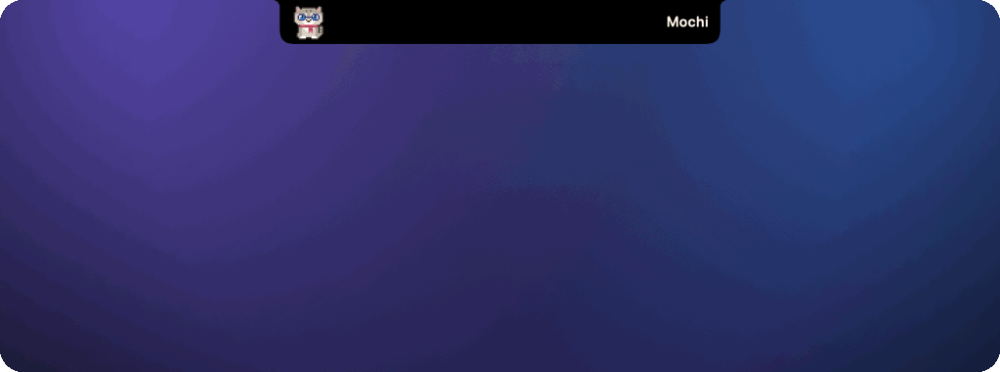
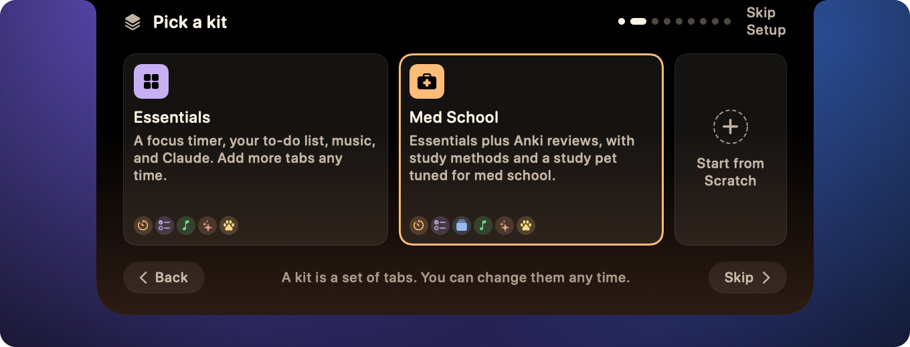

<p align="center">
  
</p>

<h1 align="center">Tabbi</h1>

<p align="center">
  A cozy study and productivity companion that lives in your MacBook's notch.
</p>

<p align="center">
  <a href="https://github.com/ethanwchen/notchdeck/releases/latest"></a>
  
  
  <a href="LICENSE"></a>
</p>

<p align="center">
  
</p>

Click the notch and it opens into a small panel of tabs.
A kit picks the tabs: Essentials for a focus timer, your day, music and Claude, or Med School for study with Anki and a pet.
More tabs are one click away in Settings.

- **Focus and study timers** in the study method you pick, with focus sounds and Do Not Disturb.
- **Today:** a checklist, your next meetings and a Plan my day that fits work into free time.
- **Anki, Party and a pet:** cards due, studying with friends and a cat or dog that cheers you on.
- **Now Playing, System and Claude:** music controls, CPU and memory, Claude limits and quick questions.
- **Eight themes,** from hardware-black Midnight to warm Cozy, and setup that happens right in the notch.
- **Private by design:** no account, no telemetry, and Claude only through your own `claude` CLI.

## Install

1. Download `Tabbi-<version>.dmg` from the [latest release](https://github.com/ethanwchen/notchdeck/releases/latest).
2. Open it and drag **Tabbi** onto the **Applications** folder.
3. Open Tabbi from Applications, then click the notch and pick a kit.

Tabbi is signed and notarized, and it keeps itself up to date.
[docs/install.md](docs/install.md) covers Homebrew, updates, troubleshooting and uninstalling.
Tabbi has no Dock icon and no menu bar item: right-click the notch for **Settings** and **Quit Tabbi**.

Requires macOS 14 Sonoma or later.
Macs without a notch get a small virtual one at the top of the screen.

## Tabs

<table>
  <tr>
    <td width="50%"><br><b>Study.</b> A session timer in the study method you pick, with points for the pet.</td>
    <td width="50%"><br><b>Today.</b> Your checklist, what's next on the calendar and a focus timer.</td>
  </tr>
  <tr>
    <td><br><b>Anki.</b> Cards due today in your decks, through AnkiConnect on your Mac.</td>
    <td><br><b>Party.</b> Study with friends and see who is focusing.</td>
  </tr>
  <tr>
    <td><br><b>Closet.</b> Tap the paw to dress up your pet with what your study points unlock.</td>
    <td><br><b>Now Playing.</b> Spotify and Apple Music, with artwork and controls.</td>
  </tr>
  <tr>
    <td><br><b>Claude Usage.</b> Your 5-hour and weekly limits and today's tokens.</td>
    <td><br><b>Setup.</b> Pick a kit, then connect only what its tabs need.</td>
  </tr>
</table>

Closed, the notch stays black and shows one quiet live activity beside it: your next meeting, the song playing, a timer or your pet.

<p align="center">
  
</p>

## Kits

A kit is a premade set of tabs for one kind of user.
Tabbi ships Essentials and Med School, adds any other tab from **Add More**, and you can switch, reset or import kits in **Settings > Modules**.
Kits are small JSON files, and [docs/kits.md](docs/kits.md) shows how to write your own.

## Privacy

Tabbi has no account, no analytics and no telemetry.
It only connects where a tab needs to: album artwork for Now Playing, AnkiConnect on your own Mac, and the friends server while Party is on.
Update checks download Tabbi's release feed from GitHub once a day; you can turn them off in **Settings > About**.
Claude features run through your local `claude` CLI, and Tabbi never reads your credentials or the keychain.

<details>
<summary><b>What each permission is for</b></summary>

Tabbi asks for a permission only when the tab that needs it is first used.

| Permission | Asked by | Why |
| --- | --- | --- |
| Automation: Spotify, Music | Now Playing, focus mode | Read the current track, control playback and start a focus playlist. |
| Calendars | Today | Show your next events and add the Plan my day blocks you accept. Events never leave your Mac. |
| Notifications | Today, Focus | Tell you when a timer ends while the notch is closed. |

Claude Usage and Ask Claude need no system permission.
Plan my day and Wrap up send your task titles and today's events to Claude through the CLI, only when you press them.
Claude Usage reads token counts from `~/.claude/projects` read-only.

</details>

<details>
<summary><b>FAQ</b></summary>

**Do I need Claude Code?**
No.
Only the Claude tabs and Plan my day in the Essentials kit use it, and they show a setup hint until the `claude` command is found.

**Why the `claude` CLI and not an API key?**
So Tabbi never handles your credentials, and your usage stays on the plan you already have.

**How do I update or uninstall it?**
Tabbi updates itself; right-click the notch and choose **Check for Updates…** to check now.
To uninstall, quit it and drag it from Applications to the Trash; [docs/install.md](docs/install.md#uninstall) also lists where your data lives.

**Does it hide in fullscreen apps or on other displays?**
By default it steps aside while an app is fullscreen and shows on every display.
Both are switches in **Settings > General**.

**Does it slow my Mac down?**
It is a small native app with no web views, and tabs only refresh while you can see them.

</details>

## Build from source

```sh
git clone https://github.com/ethanwchen/notchdeck.git && cd notchdeck
scripts/run.sh                                   # build and launch build/Tabbi.app
TABBI_DEMO=1 swift run Tabbi --snapshot snapshots   # render every panel to PNG with sample data
```

You need Xcode 26 or later; the app runs on macOS 14 or later.
The only third-party dependency is Sparkle, for updates.

## Contributing

Contributions are welcome.
Start with [CONTRIBUTING.md](CONTRIBUTING.md), then [AGENTS.md](AGENTS.md) for the architecture and design rules, and [docs/ROADMAP.md](docs/ROADMAP.md) for what's next.
Please follow the [Code of Conduct](CODE_OF_CONDUCT.md) and report security issues as described in [SECURITY.md](SECURITY.md).

## License

[MIT](LICENSE)
