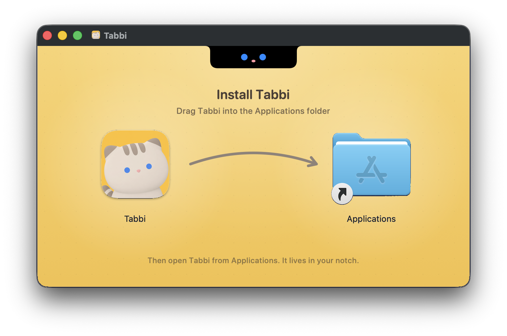
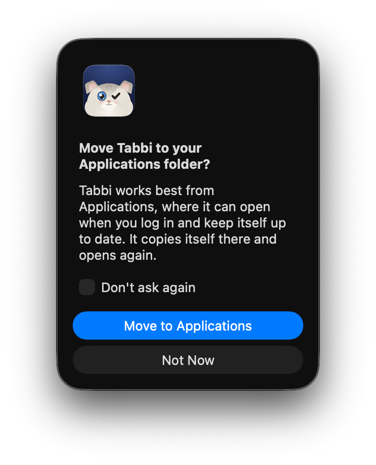
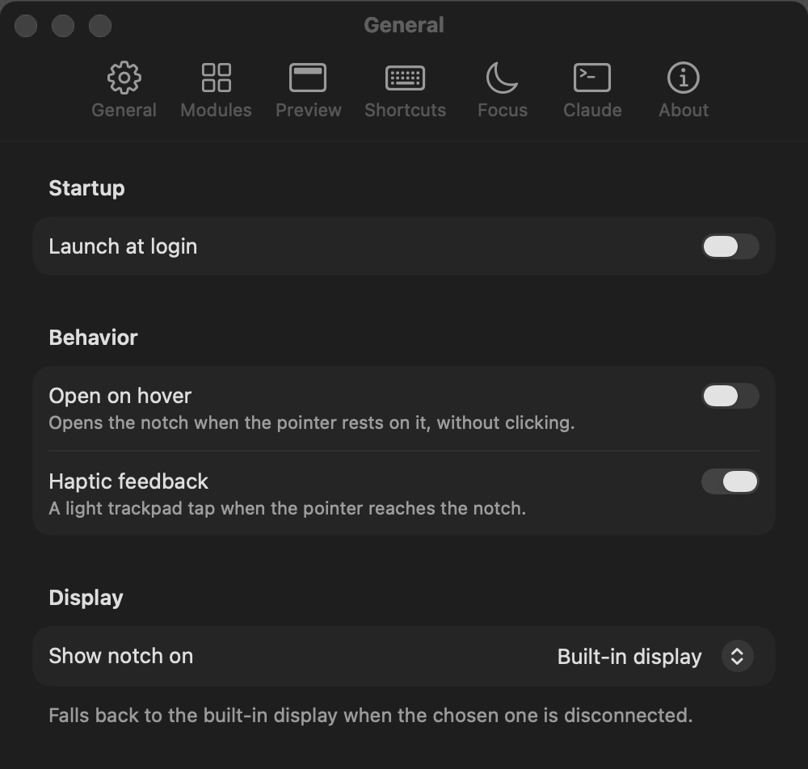
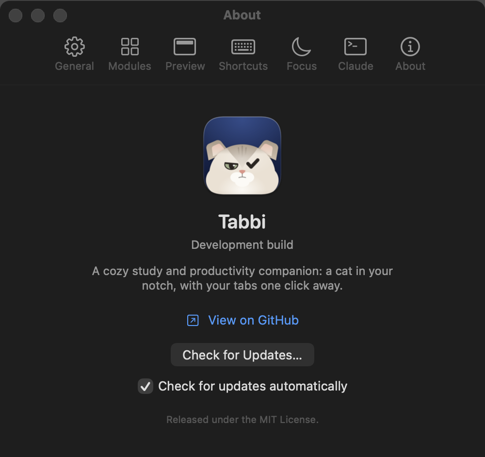
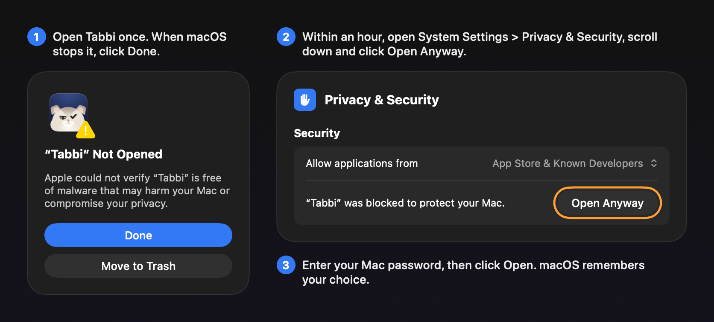

# Installing Tabbi

Tabbi lives in your MacBook's notch.
Installing it takes about a minute, and it keeps itself up to date after that.

## What you need

- A Mac with macOS 14 Sonoma or later, Apple silicon or Intel.
- A MacBook with a notch for the full experience.
  On other screens Tabbi shows a small notch of its own at the top center.

## Install

1. Download **Tabbi-&lt;version&gt;.dmg** from the [latest release](https://github.com/ethanwchen/tabbi/releases/latest).
2. Open the downloaded file.
   A window like this one appears:

   

3. Drag the **Tabbi** icon onto the **Applications** folder.
4. Open **Applications** in Finder and double-click **Tabbi**.
   macOS asks once whether you want to open an app downloaded from the Internet.
   Click **Open**.

That's it.
Tabbi is signed by its developer and checked by Apple, so there is nothing else to approve.
You can eject the Tabbi disk image in Finder and delete the downloaded file.

Tabbi has no Dock icon and no menu bar item.
Look at the notch: click it to open your tabs.
On its first launch Tabbi greets you with a short welcome that helps you pick your tabs.

### If you opened Tabbi straight from the disk image

Tabbi works best from your Applications folder, where it can open when you log in and update itself.
If you open it from the disk image or from Downloads, it offers to move itself there:



Click **Move to Applications**.
Tabbi copies itself, ejects the disk image and opens again from Applications.
If you click **Not Now**, it asks again next time, unless you tick **Don't ask again**.

## Open at login

Tabbi turns on **Launch at login** the first time it runs from Applications, so your notch is ready every time you start your Mac.
macOS shows a "Login Item Added" notification when that happens.

To change it, right-click the notch, choose **Settings**, and use the switch in **General**:



You can also manage it in **System Settings > General > Login Items**; Tabbi's switch follows whatever you choose there.

## Updates

Tabbi checks for updates once a day.
When a new version is out, it shows what changed and offers to install it; the update takes a few seconds and Tabbi reopens by itself.

To check right away, right-click the notch and choose **Check for Updates…**, or open **Settings > About**:



Untick **Check for updates automatically** if you would rather check yourself.
Update checks download a small file from GitHub, where Tabbi's releases are published; nothing about you or your Mac is sent.

## Install with Homebrew

If you use [Homebrew](https://brew.sh), you can install Tabbi from the project's own tap in the Terminal instead:

```sh
brew install --cask ethanwchen/tap/tabbi
```

Naming the tap this way also tells Homebrew to trust it, which newer versions of Homebrew ask for before they load a cask from outside their main catalog.

Tabbi updates itself, so `brew upgrade` leaves it alone; that is expected.

## Permissions

Tabbi asks for a permission only when a tab first needs it, for example when Now Playing first talks to Spotify or Music, or when Today first reads your calendar.
The README's [Permissions](../README.md#permissions) section lists each one and why.
Updates keep the permissions you gave, so macOS does not ask again after Tabbi updates itself.

## Something went wrong?

**I can't find Tabbi after opening it.**
Tabbi has no window or Dock icon.
Move the pointer to the notch at the top of the built-in screen and click it.
If you use an external display, open **Settings > General > More options > Show notch on** to choose where it appears.

**I opened Tabbi twice.**
Only one copy runs at a time.
Opening it again brings up Settings in the copy that is already running.

**macOS says "Tabbi Not Opened" or "Apple could not verify Tabbi".**
The releases on GitHub never show this.
You see it only with a copy that someone built without a Developer ID, such as a test build from a contributor.
To open it anyway, follow these steps once:



1. Open Tabbi.
   When macOS stops it, click **Done** (not Move to Trash).
2. Open **System Settings > Privacy & Security** and scroll down to **Security**.
   Next to "Tabbi was blocked to protect your Mac", click **Open Anyway**.
   The button only shows for about an hour after step 1; if it is gone, repeat step 1.
3. Enter your Mac password, then click **Open** in the dialog that follows.
   macOS remembers this, so you only do it once per copy.

On macOS 14 Sonoma you can instead right-click Tabbi in Applications, choose **Open**, and confirm.
On macOS 15 and later that shortcut no longer works, so use the steps above.

If you are comfortable with the Terminal, this command does the same in one step:

```sh
xattr -dr com.apple.quarantine /Applications/Tabbi.app
```

**macOS says "Tabbi is damaged and can't be opened".**
The download was cut short or changed on the way.
Move Tabbi to the Trash, download it again, and compare it with the release's `SHA256SUMS` file if you want to be sure:

```sh
shasum -a 256 Tabbi-<version>.dmg
```

## Uninstall

1. Quit Tabbi: right-click the notch and choose **Quit Tabbi**.
2. Open **Settings > General** first and turn off **Launch at login**, or remove Tabbi later in **System Settings > General > Login Items**.
3. Drag **Tabbi** from **Applications** to the Trash.

That removes the app.
Your tabs, tasks and settings stay on your Mac in case you come back.
To remove them too, choose **Go > Go to Folder…** in Finder, paste each of these paths, and move what it shows to the Trash:

- `~/Library/Application Support/Tabbi`
- `~/Library/Preferences/dev.tabbi.Tabbi.plist`
- `~/Library/Caches/dev.tabbi.Tabbi`
- `~/Library/HTTPStorages/dev.tabbi.Tabbi`

If you installed with Homebrew, `brew uninstall --cask tabbi` removes the app, and `brew uninstall --zap --cask tabbi` also removes the data above and the login item.

## For maintainers: publishing a release

[release.md](release.md) lists every step to ship a release, from the one-time setup to the Homebrew cask.
