# Tabbi pets

A study-buddy cat or dog lives in the notch.
This document explains how pet sprites are drawn, composed, and rendered, and how to add a breed.

Status: the sprite format, palettes, pattern zones, renderer, all nine cat breeds, all eight dog breeds, every costume, the front-facing animations (idle, blink, sit, sleep, peek in and out, alert, celebrate, yawn, hop, typing, coffee, wave, groom, tail swish, nap), the walk cycle, the stretch, the animation state machine, and the app's `PetView` exist.


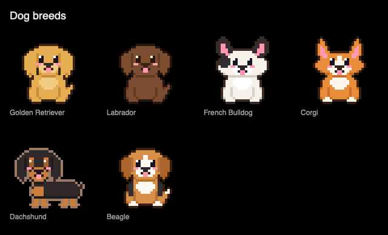

## Look at the art

```sh
swift run PetGallery /tmp/petgallery          # writes contact sheets as PNGs at 4x
swift run PetGallery /tmp/petgallery sphynx   # close-up sheets for one breed (default: British Shorthair)
```

Sheets are drawn on pure black, exactly like the notch.
Do not commit the output folder; curated sheets live in `docs/study/images/`.

## Sprite format

Art is plain text inside Swift string literals (`Sources/TabbiKitCore/Pets/Art/`).
Each character is one pixel.
A grid never stores a color, only what the pixel *means*; palettes turn meanings into colors.
That is what lets one drawing serve every breed, user recolor, and costume color.

```swift
static let ear = SpriteGrid(art: """
    .ee.
    ePPe
    eBBe
    """)
```

All rows of a grid must be the same width.
Parse errors report the 1-based row and column of the problem.

### Palette roles (uppercase)

| Symbol | Role | Used for |
| --- | --- | --- |
| `O` | outline | inner lines; outer outlines are automatic |
| `B` | furBase | main fur |
| `S` | furShade | shading, leg separation |
| `A` | furAccent | stripes, points |
| `K` | furSpot | second marking color (calico black) |
| `W` | belly | light fur |
| `E` | eye | pupils |
| `L` | eyeLight | eye highlight |
| `N` | nose | nose (and dog mouths) |
| `R` | mouth | cat mouth lines; dark on light fur, warm rim on dark fur (picked per pixel from the 4 neighbors) |
| `P` | blush | cheeks, inner ears |
| `C` | costumeBase | scrubs and the matching surgical cap |
| `D` | costumeShade | scrubs shading and hems |
| `T` | costumeTrim | V-neck piping, badge, cap dots |
| `U` | coat | white coat |
| `V` | coatShade | white coat seams and lapels |
| `G` | accessoryBase | scarf, beanie, stethoscope tubing |
| `J` | accessoryShade | knit shading and cuffs |
| `Q` | ink | graduation cap, glasses frames, head mirror band, pen |
| `Y` | gold | graduation tassel |
| `M` | metal | stethoscope chest piece, head mirror |
| `Z` | effect | sleep "z", sparkles, speech bubble |
| `H` | heart | celebration heart |
| `F` | leaf | frog hat, flower crown vine |
| `I` | leather | cowboy hat |
| `X` | crimson | superhero cape folds, lining and hem (uppercase; lowercase `x` erases) |

### Special cells

| Symbol | Meaning |
| --- | --- |
| `.` or space | transparent, lower layers show through |
| `x` | erase whatever lower layers painted here (a cap hiding ear tips) |

### Pattern zones (lowercase)

Shared body art marks regions whose color depends on the breed.
Each breed's `PetPattern` maps a zone to a palette role.
Unmapped zones fall back to their default.

| Symbol | Zone | Default |
| --- | --- | --- |
| `m` | muzzle | belly |
| `c` | chest | belly |
| `p` | paws | furBase |
| `t` | tailTip | furBase |
| `e` | ears | furBase |
| `f` | mask (center of the face) | furBase |
| `s` | stripes | furBase |
| `a` | patchA | furBase |
| `b` | patchB | furBase |

For example, the tuxedo maps paws, muzzle, chest, and mask to `belly`, and the Siamese maps ears, mask, muzzle, paws, and tail tip to `furAccent`.

## Composition

Every frame is a 32x32 canvas with the paws on the bottom row, so frames swap without jitter.
Layers are stamped in order, later layers painting over earlier ones:

1. body (shared per body shape)
2. pattern (the breed's zone map, applied while stamping)
3. face (eyes, nose, blush; swapped for blinks and expressions)
4. costume
5. accessory

After stamping, `PetCanvas.outlined()` adds a one-pixel outline around the whole silhouette using direct neighbors only, so corners stay round and every costume is outlined consistently.

## Costumes

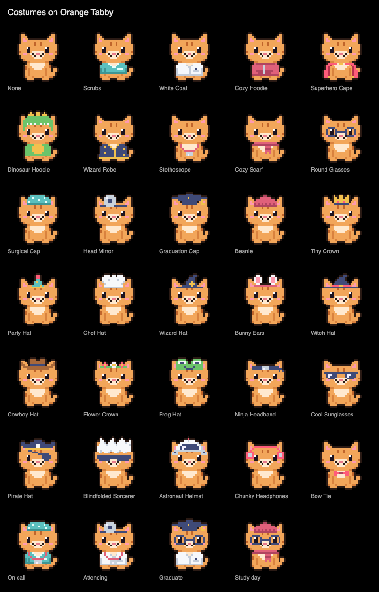

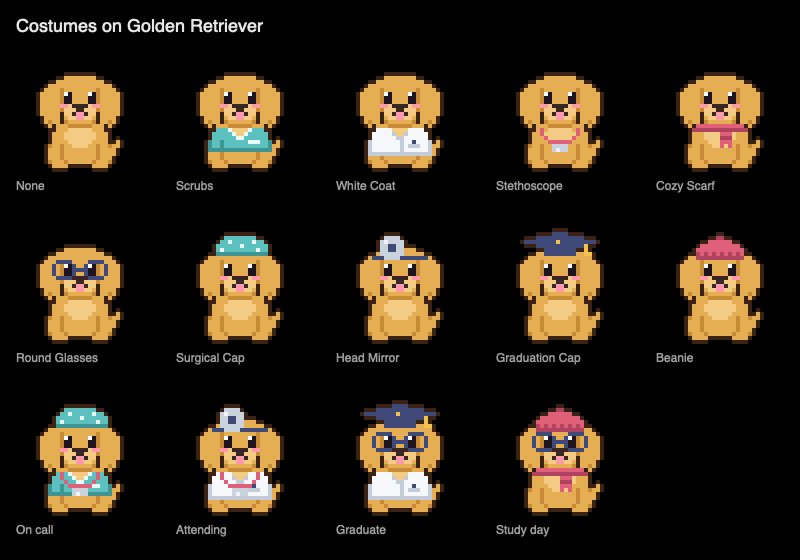

A pet wears one `PetOutfit` (`none`, `scrubs`, `whiteCoat`, `cozyHoodie`, `superheroCape`, `dinosaurHoodie`, `wizardRobe`) and accessories (`PetAccessory`).
Each accessory has a slot (neck, face, or head); a pet wears at most one per slot.
`PetAccessory.wearable(_:)` keeps the last item listed per slot and sorts them in drawing order, so hats always land on top.

Costume art lives in `Art/CostumeArt.swift` and is anchored to the pose layout instead of per-breed positions:

- Body items (outfits, stethoscope, scarf) have one grid per body family (cat, dog, long dog), the same size as that family's body and stamped at the same origin.
  They also have two walking grids: `walk` over the shared cat and dog walking torso, and `walkLong` over the dachshund's.
- Face items (glasses, sunglasses) are a `FaceItem`: a cat and a dog grid plus an `eyeRow`, the grid row that lands on each head's eye row.
  Dog eyes sit close together, so the dog lenses are wider than the eyes; frames touching the pupils blur into them.
- A head item can bring a face piece along (the pirate hat's eyepatch, the sorcerer's blindfold).
  Such items set `coversEyes`, and `PetAccessory.wearable` lets them replace whatever is in the face slot, and the other way round, so glasses never pile onto an eyepatch.
- Hats are 20 wide like every head.
  Each declares a `sitRow`, the grid row that lands on the head's `skullTop` (the row just below the top of the skull, so hats rest on the head instead of floating).

Colors come from dedicated roles so items never fight: scrubs and the surgical cap share the recolorable costume roles (a matching set), the white coat has its own roles so recolored scrubs never tint it, and knit items share the recolorable accessory roles.
Accessories are drawn after the face and before the automatic outline, so hats get the same rounded outline as the pet.

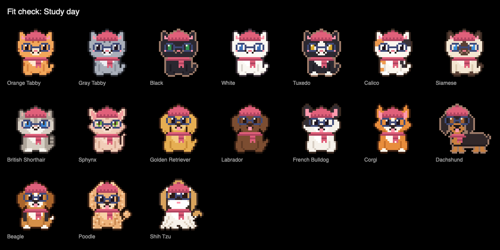

### Adding a costume item

1. Add a case to `PetOutfit` or `PetAccessory` (with its `slot` and `displayName`), and give it a price in `PetItem.cost`, a Closet shelf in `PetItem.theme` (Study, Cozy, Fantasy, Seasonal or Silly) and the catalog `release` that adds it.
   Items from `PetItem.latestRelease` wear a "New" badge in the Closet until the user owns them.
2. Draw it in `CostumeArt` using costume roles only: a `BodyItem` for each body family plus its two walking torsos, a `FaceItem` with its `eyeRow`, or a `HeadItem` with its `sitRow`.
   A body item that sticks up out of the silhouette (the dinosaur's back spikes, the cape streaming up behind a walking pet) sets `rise`, the rows every one of its grids starts above the body's top row.
3. Map the case to its art in `PetComposer`.
   An outfit with a head part (the dinosaur hood) returns it from `outfitHood`; it is placed like a hat, moves with the head, and any hat is worn over it.
4. Run `swift test` and review `contact-*.png` (every item on every breed) and `strip-<item>.png` (every breed through the key frames of every animation) from `PetGallery`.
   `PetCostumeFitTests` compares each dressed frame of every animation with the same frame undressed, for every item and breed, so new items and new breeds are covered with no new expectations:
   every item shows and keeps a one-pixel margin inside the frame, head and face items keep the same offset from the nose in every frame, and hats rest on the skull without covering an eye (items with `coversEyes` must hide at least one).
   Face items must reach across every breed's eye rows, and no outfit, hood included, may cover an eye in any frame.
   Leave a column of fur between an item and the eyes where you can: the black cat's eyes are green, so a green hood flap right beside them swallows the eyes.
   Check thin lines against dark fur too: a 1px navy headphone band disappeared on the Labrador, dachshund and black cat, so it now matches the red cups.

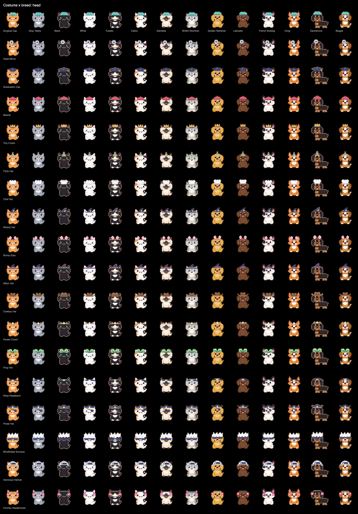

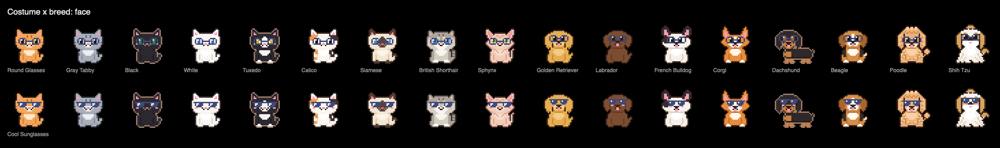

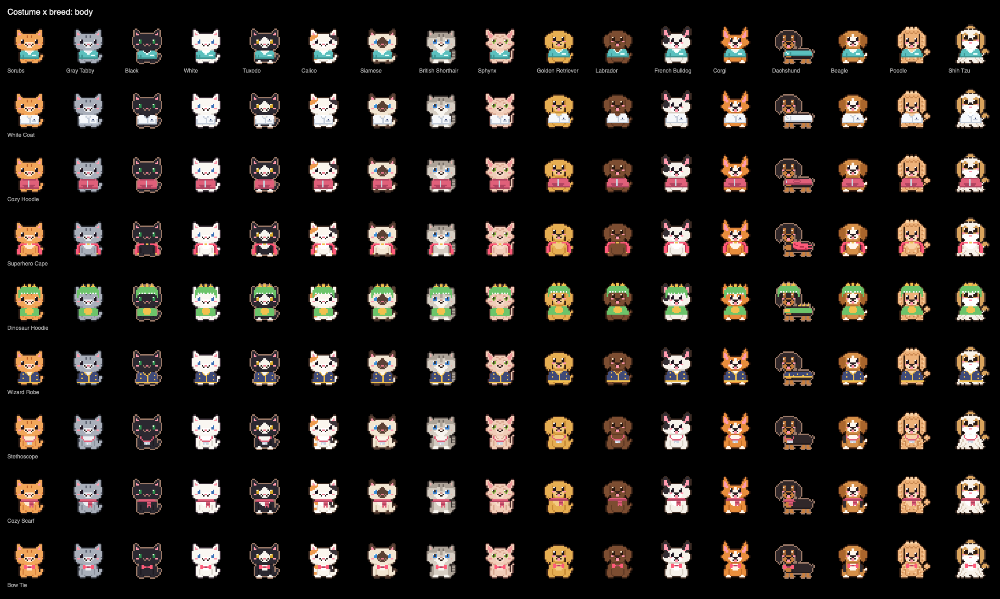

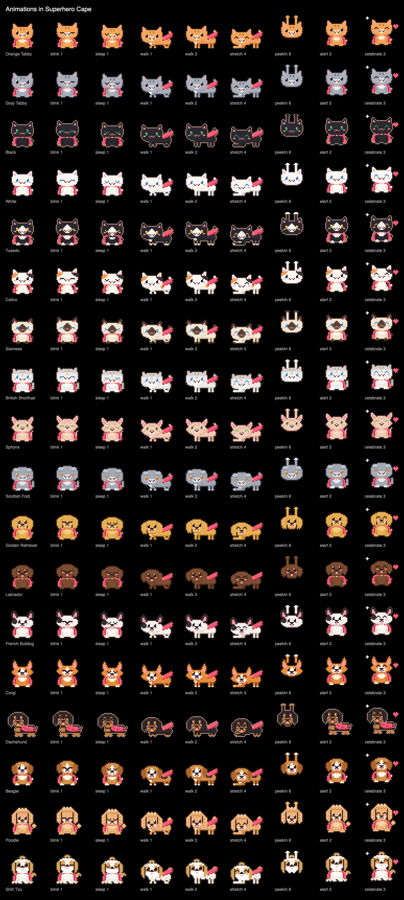

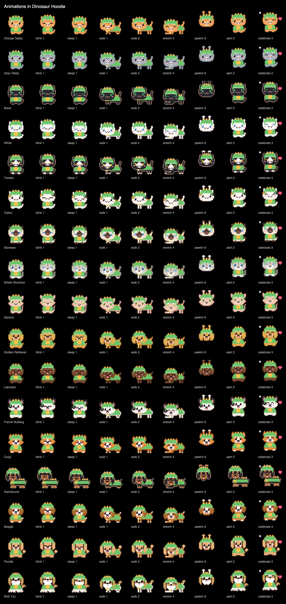

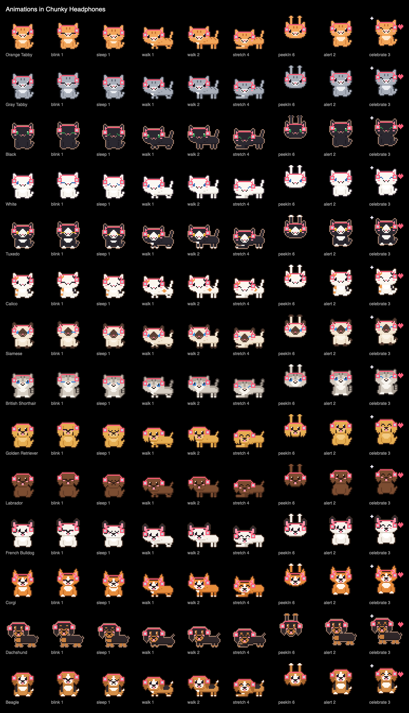

## Animations

`PetComposer.clip(_:for:outfit:accessories:)` builds a `PetClip`: a list of `PetFrame`s, each with its own `duration` in seconds.
`clip.frame(at: elapsed)` picks the frame to show; looping clips (idle, sit, sleep, walk, typing, coffee, nap) wrap around, one-shot clips (blink, stretch, peek, alert, celebrate, yawn, hop, wave, groom, tailSwish) hold their last frame until `PetAnimator.advance(to:)` sees the clip's duration has passed and moves the pet on.

Front-facing animations are not drawn frame by frame.
Each frame is the sitting composition in a `PetPose`, so every breed and costume animates without extra art:

| Pose field | Effect |
| --- | --- |
| `eyes` | `.open`, `.closed` (blink), `.sleepy` (soft curves), `.happy` ("^" arches), `.squeezed` ("> <", mirrored for the right eye) |
| `mouth` | `.closed` (the face as drawn), `.open` (a small "o"), `.wide` (a big yawn with the tongue showing) |
| `headDrop` | Sinks the head (and its hat and glasses) into the shoulders, for breathing and dozing; -1 tips it back for a yawn |
| `prop` | Something held in front of the pet: `.laptop(tap:)` (a paw lifted to type, -1 left, 1 right, 0 resting) or `.mug(raise:)` (0 in the lap, 1 on the way up, 2 at the mouth) |
| `gesture` | The left front paw lifted off the floor: `.wave(swing:)` (0 leans out from the head, 1 swings back in beside the cheek) or `.groom(reach:)` (0 just under the chin, 1 under the tongue for a lick, 2 up over the left cheek to wash) |
| `tailSwing` | Pixels the tip of the tail leans out to the side, 0 at rest; tailless breeds pop out a stub by the haunch instead, raised `tailSwing` px |
| `lift` | Raises the whole pet off the baseline, for hops |

Eye states live in `EffectArt` as 4x3 grids centered on the 2x3 open eye.
A 3-wide open eye (the British Shorthair's) gets the spare pixel on its cheek side, and a pupil drawn in the outline color inside an eye is cleared with it.
The composer finds the open eyes on the face's eye row, clears them so the head's fur shows through, and stamps the new state, so a new face only needs its open-eyed version.
Sleepy eyes also close the mouth: blush pixels below the cheek row (the eye row + 3) are cleared, so a dog's panting tongue tucks away and its nose-colored mouth corners read as a closed "w".
Draw a tongue with the blush role below the cheek row and it will hide itself during sleep.

Props come from `PropArt` and are drawn in front of the pet with their own outline and the breed's paw zone, so they read on fur of any color.
The laptop stands on the floor, centered under the head, with the paws resting over the lid's top edge; the mug is centered on the mouth (found like an open mouth, below) and rises from the lap to cover the mouth for a sip.
The mug's steam curls over the chest, so it is line art in the mouth role, which turns dark on light fur and light on dark fur.

Gestures come from `PawArt`: a forearm in plain fur ending in a paw-zone paw, outlined all round except where it meets the body, so it reads over the head and chest of any breed.
A gesturing pet lifts its left front paw off the floor (`PawArt.liftingLeftPaw`): the paw shape touching the floor furthest left is found from the body art, its floor run is cleared (a Poodle's cuff with it), paw pixels tucked against fur turn into a fold of shaded fur, and a leg standing free (the dachshund's) goes entirely.
The waving arm grows from the left shoulder (3 px in and 4 px down the body) and holds the paw beside the head, clear of the eyes.
The grooming leg rises straight from just above the floor to the mouth, found like an open mouth, so it lines up on every head.

A swinging tail is bent from its base by `TailArt`, so every breed keeps its own tail (the Sphynx's whip, the British Shorthair's rings, the Poodle's pom, the Shih Tzu's plume).
Dogs draw the tail as its own grid; cats and the dachshund draw it into the sitting body, so the composer cuts it out at the body's tail column first (`SitLayout.tailColumn`: 17 for cats, 23 for the dachshund).
The base row stays put and each row above leans a little further, never more than a pixel past the row below, so the tail stays one connected stroke.
The swing is cut down to the room left in the frame, which keeps the dachshund's tail, near the right edge, to a 1 px flick.
The corgi and French bulldog have no tail, so `TailArt.nub` pops out past the haunch and bobs instead.

Open mouths are found from the art too: `EffectArt.mouth(_:in:)` centers a 4-wide mouth on the nose's top row, on the first row below the nose, so it covers any face's own mouth lines or tongue.
Its corners are the muzzle zone, which hides what was drawn there.
When the row under the nose carries nose-colored mouth corners (most dogs), a row of muzzle covers them and a shorter mouth opens one row lower, so it never merges into a dark nose and still ends on the chin.

| Animation | Frames |
| --- | --- |
| idle | Head nods down 1 px and back, 1.1 s + 0.9 s, so the pet breathes slowly |
| blink | One closed-eye frame, 140 ms, played now and then over idle |
| sit | The plain sitting frame, held |
| sleep | Sleepy eyes, a closed mouth, head sinking 1-2 px, a small "z" by the ear and a larger one drifting up |
| peekIn / peekOut | The pet dangles from the notch by its front paws: the head lowers into view from beyond the top edge, bounces 1 px, and rests with its chin on row 20; peekOut is the same frames reversed |
| alert | Two hops (2 px, then 1 px) and a hold; every frame has a `bubbleAnchor` at the top-right of the head for the app's speech bubble |
| celebrate | Happy eyes, a 3 px hop, a heart floating up beside the head, and sparkles |
| yawn | Head tips back 1 px, eyes squeeze shut ("> <") and the mouth opens to a small "o", then wide with the tongue showing (held 900 ms), closes, and settles through sleepy eyes back to sitting; about 2.6 s |
| hop | Happy eyes, a crouch, a 3 px hop and a smaller 2 px one, each landing in a squash with dust puffs beside the paws, then back to sitting; about 1.2 s and no heart, so it reads as plain joy rather than a finished session |
| typing | Alternating paw taps over a tiny laptop (120 ms up, 100 ms down), then a pause with the head bent to read the screen (1.2 s); loops while a focus session runs |
| coffee | A mug in the lap with steam curling (four 450 ms frames), raised to the mouth for a 900 ms sip with closed eyes, lowered with a happy "ahh"; about 3.9 s, loops for breaks |
| wave | The left paw goes up beside the head and swings out and back three times with happy eyes (220 ms out, 180 ms in), then comes down; about 1.7 s |
| groom | The left leg lifts to the chin, three licks (the paw rises under an open mouth for 180 ms, drops for 120 ms) with the eyes shut, two strokes over the left cheek with the head bent into them, then a contented look; about 2.3 s |
| tailSwish | The tail sweeps out to the side and back twice, the first sweep slower (400 ms held at the far end) and the second quicker, everything else still; about 2.1 s |
| nap | A deeper sleep than `sleep`, curled up on the floor (see below): sleepy eyes, the back swelling a pixel on each slow breath, and "z"s drifting up like `sleep`; four 1 s frames, loops |
| walk | Four 150 ms steps of a trot, side-on (see below) |
| stretch | A side-on play bow: down in three steps, a held bow with happy eyes and a tail wag, then back up (see below) |

Effects (the "z", heart, and sparkles) use the `effect` and `heart` roles and are painted after outlining and only into transparent pixels, so they float free of the pet and never hide part of a hat.
The peek legs come from `EffectArt.hangingLeg`, drawn behind the head with the breed's paw zone.

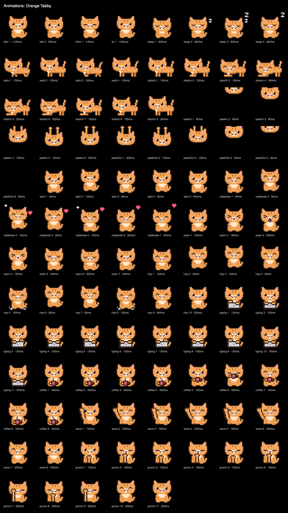

`PetGallery` also writes `yawn.png`, `hop.png`, `typing.png`, `coffee.png`, `wave.png`, `groom.png`, `tailSwish.png` and `nap.png`, every breed through every frame of each move, one row per breed:

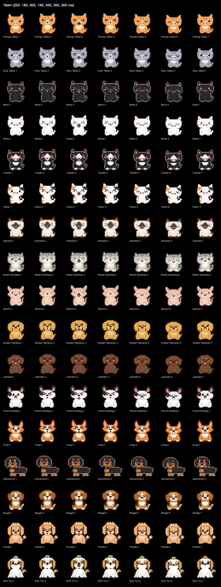

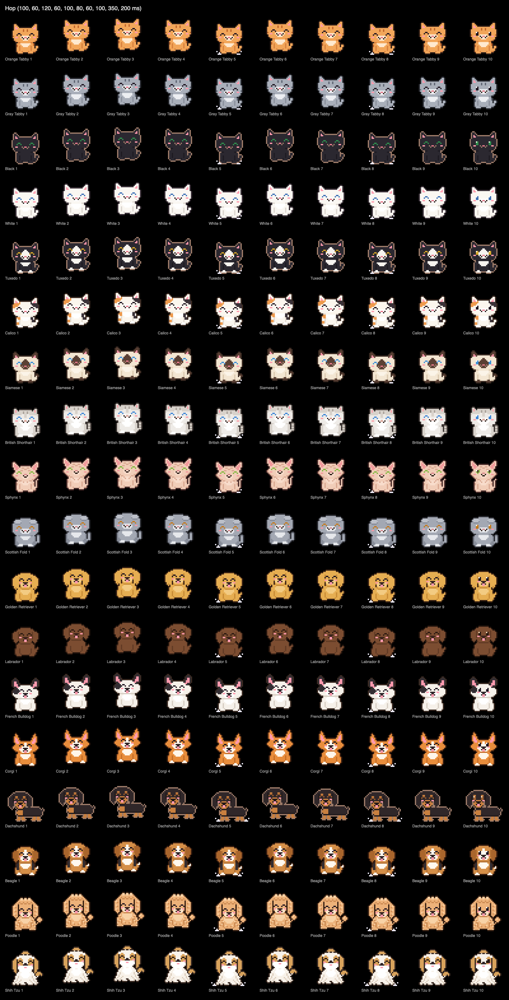

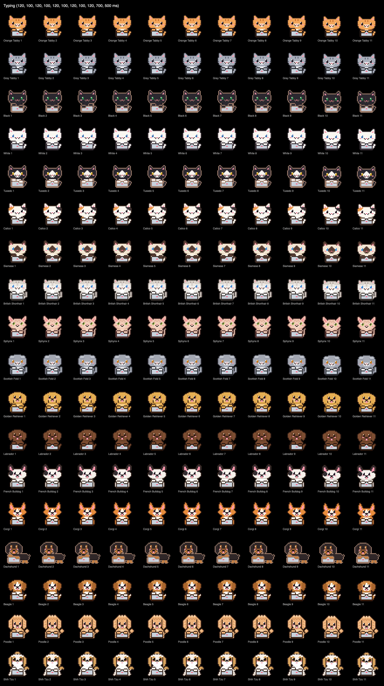

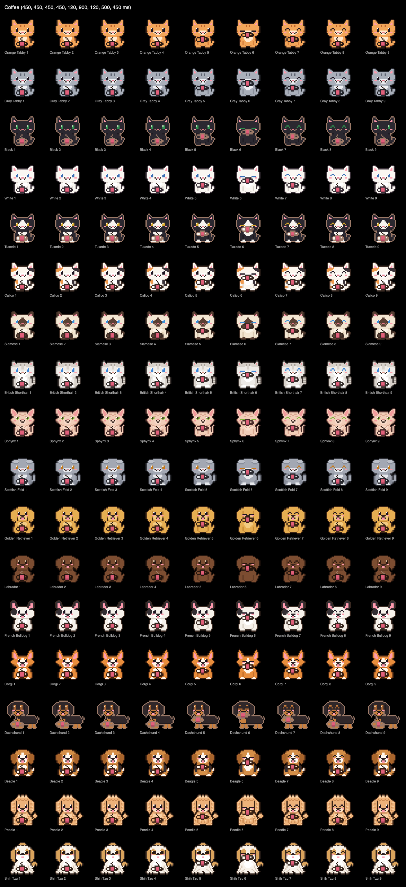

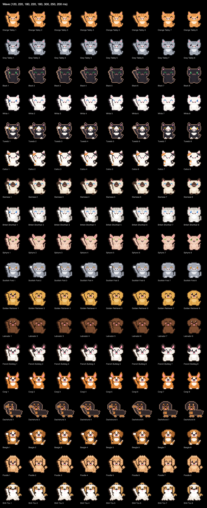

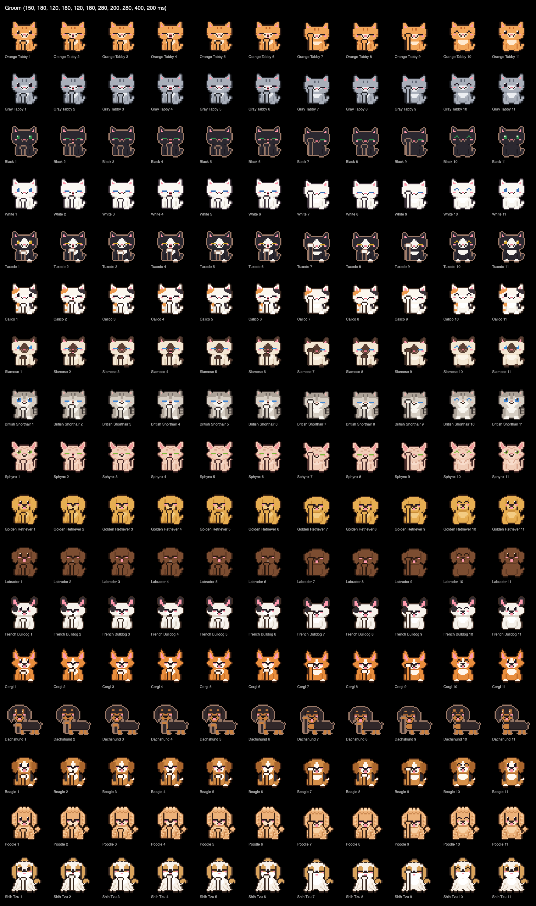

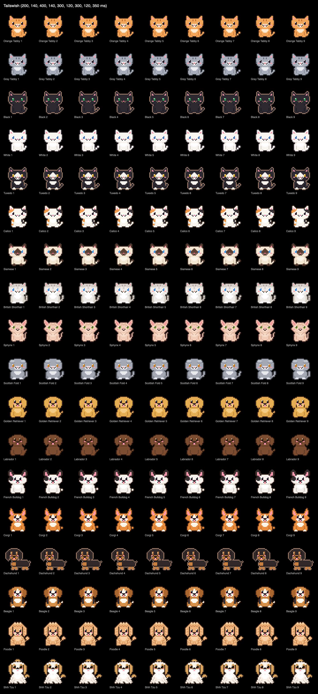

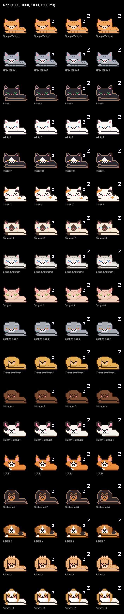

### Walking

The walk, the stretch and the nap are the animations that are not sitting poses.
It is drawn chibi-style: the usual front-facing head sits in front of a side-on torso, so the face, glasses, and hats need no walking art and stay readable at notch size.
Pets walk toward the left; mirror the frames to walk right.

`Art/WalkArt.swift` holds the walking pieces:

- Torsos: `catTorso` and `dogTorso` share one size (22x7, so torso costumes fit both), and `longTorso` (23x6) sits lower on shorter legs for the dachshund.
  The cat torso carries stripe and calico patch zones; the dog torso carries the beagle saddle.
  The British Shorthair walks on `roundCatTorso`, the same size with a taupe back, and swings the ringed `roundCatTail`.
- Tails: two sway positions per family; the tail swings once per half cycle so it never flickers.
  Stubby-tailed breeds (`hasTail == false`) skip it.
- Legs: `WalkArt.leg(height:lean:far:)` generates every leg, with the paw zone on the bottom row.
  Far legs use `furShade`, which keeps them apart from the near legs without an outline between them.
- `WalkArt.cycle`: the gait, four steps where diagonal leg pairs move together (contact, passing, mirrored contact, passing).
  On contact steps the torso and head sink one pixel onto the bent legs, which gives the walk its bounce.

Torso costumes are stamped right after the torso, before the head, because the head is in front of the body when walking.

The nap reuses the walking pieces too: the torso (with its torso costumes, but no upright tail) lies on the floor where the legs would be, and the head rests at its front with the chin on row 27.
On a breath the middle of the back is laid a pixel higher, so it swells without leaving a gap under the belly.
`TailArt.wrapped(length:)` draws the tail coming round from under the rump and running along the floor in front of the body, its tip curling up before the chin; it is outlined on its own layer, so it stays apart from fur of the same color behind it.
Tailless breeds (corgi, French bulldog) lie with their chest showing instead.
`PetComposer.WalkLayout` holds the per-family positions (torso origin, hips, tail, and the chin row the head rests on).

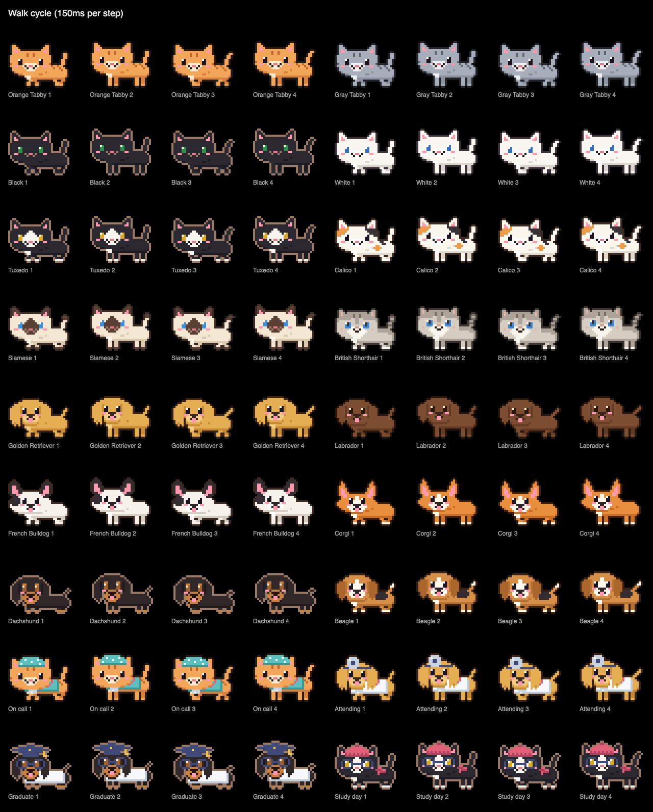

### Stretching

The stretch is a play bow built from the walking body, so it needs no new torso, head, or costume art.
The composer's `stretching(depth:wag:)` stance:

- keeps the back legs standing straight, so the rump and tail stay where they are when walking;
- bends the torso, with its tail and torso costumes, by moving each column toward the chest down by up to `depth` pixels (the rump third stays put);
- folds the front legs with `WalkArt.reachingLeg(height:reach:far:)`: shorter legs whose forearms lie flat and reach `2 * depth` pixels forward, drawn over the lowered chest so the paws show under the chin;
- lowers the head by `depth`, so hats and glasses follow.

The bow is at most `legHeight - 1` deep, so the short-legged dachshund bows 2 px instead of 3 and its chin never lands on its paws.
The first and last frames equal the walk's passing step, so a stretch can chain with walking without a jump.

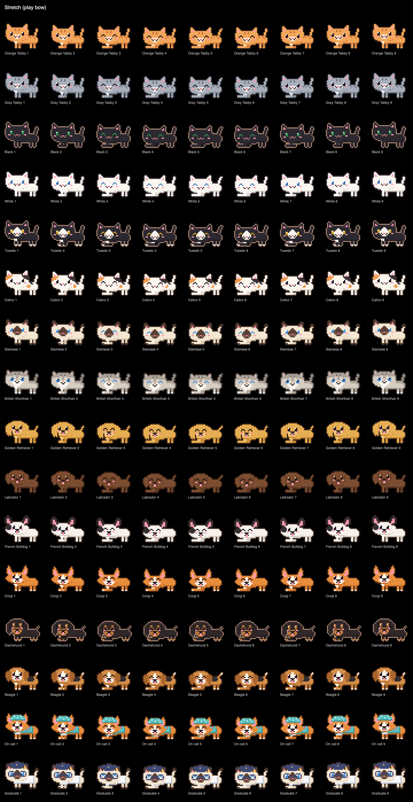

### Playing animations

`PetClipSet` builds every clip for one dressed pet up front, so a player never composes frames while animating.
`PetAnimator` decides what plays: a pure value driven by timestamps in seconds and a seeded random generator, so it is deterministic and fully unit-tested.

The pet is always in one `Place`, and each place has a resting animation:

| Place | Rests in |
| --- | --- |
| `beside` | `sleep` while asleep; awake, it follows the `Activity`: `typing` while `studying`, `coffee` while `onBreak`, and `idle` with a `blink` every 2.5-6 s (random) while `free` |
| `hanging` | The held last frame of `peekIn` |
| `hidden` | Nothing; `playback` is nil |

| Event | Effect |
| --- | --- |
| `nudge` | Beside: wakes and plays `alert`, except during a celebration. Hidden: peeks out |
| `celebrate` | Beside only: wakes and plays `celebrate`, overriding an alert |
| `sleep` / `wake` | Beside only; a running alert, celebration, or stretch finishes first. Waking plays `stretch`, then idles; a nudge still interrupts it |
| `peekIn` / `peekOut` | Hidden to hanging and back |
| `appear` / `disappear` | Cut straight to beside (awake) or hidden |
| `activity(_:)` | Switches what the pet rests in. Leaving `studying` after at least `PetAnimator.longSession` (45 min) of focus plays `yawn` first; a running alert, celebration, or stretch finishes first, and the yawn follows it |

When a one-shot clip ends, the next animation starts at the exact moment the clip ended, not at the next tick, so timing never drifts with the frame rate and jumping ahead lands in the same state as ticking.
Peek transitions can't be interrupted: an event that arrives mid-climb is kept (latest wins) and applied as the transition ends.
To draw, call `animator.advance(to: now)` and then `clipSet.frame(for: animator.playback, at: now)`.
`clipSet.nextChange(for: animator, after: now)` says when the drawn frame next changes (a frame boundary or the next blink), or nil when the picture holds (hidden, or hanging), so a player redraws only on real changes instead of polling.

### In the app

`Sources/TabbiKit/Pets` plays a pet in SwiftUI:

- `PetPlayer` (an `ObservableObject`) owns the clip set and the animator.
  Features drive it with `send(.nudge)`, `send(.celebrate)`, and so on, and `update(profile:)` swaps the look in place.
- The closed notch's pet (`NotchPetWing`) maps the shared `PetMood` to an activity with `PetAnimator.Activity(mood)`, so it types on its laptop while the shared focus clock runs a focus phase, sips coffee on breaks, and yawns when a long focus stretch ends.
  Snapshot runs render it as `closed-pet-studying.png`, `closed-pet-break.png` and `closed-pet-asleep.png` (whichever differ from the pet's current mood in `closed-pet.png`).
- `PetView(player:pixelSize:)` is a fixed square of 32 sprite pixels (32 pt at the default `pixelSize` of 1, 24 pt at 0.75).
  A `TimelineView` with `PetFrameSchedule` redraws exactly at each `nextChange`, so an idle pet redraws a few times a second and a hidden or hanging pet not at all.
- Frames are rendered at a whole number of device pixels per sprite pixel and drawn without interpolation; they are pixel-perfect whenever `pixelSize` times the display scale is a whole number.
- Alert frames show a pixel-art "!" bubble on the same pixel grid, with its tail one pixel up and right of the frame's `bubbleAnchor`.
  The bubble can rise up to a few pixels above the view's top edge, so leave room above the pet.

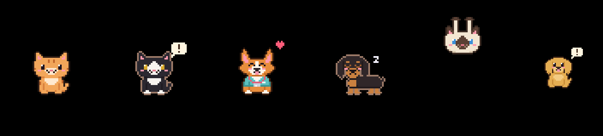

## Profile, points, and unlocks

`PetProfile` is what the user chose: a name, a breed (the species is derived from it), palette overrides, an outfit, and accessories.
Its initializer and editing methods keep it valid at all times:

- Names are trimmed, inner whitespace is collapsed, and the length is capped at 16; an empty name falls back to the breed name.
- Only `PetPaletteRole.userEditable` roles can be overridden, so eyes, outline, and effects keep every pet readable.
- Accessories always go through `PetAccessory.wearable(_:)`; `wear(_:)` replaces whatever is in the same slot.
- `palette` is breed colors, then overrides, then `withVisibleRim()`, so a pet recolored black still gets its warm rim.
- `tintFur(_:)` recolors all fur from one picked color, and `tintFur(nil)` returns the fur to the breed colors without touching costume colors.
- A pet still called by its breed name follows breed changes, so it never keeps a stale breed name; a name the user chose stays.

Costume items are earned with study points, apart from a few free starters (the scarf, the party hat and the bow tie); breeds and colors are always free.
`PetItem` wraps an outfit or accessory with a stable string id (`outfit.scrubs`, `accessory.beanie`) and a `cost`.
Cozy basics are cheap so the first finished 25-minute session unlocks the beanie; the sorcerer and the graduation cap are long-term goals.
A save from an older build that bought an item that is free now gets its price back once (`PetPointsLedger.refundedPrices`).

`PetPointsRules` turns a session into points: one point per full minute, nothing under 5 minutes, and a 10-point bonus for completing a session of at least 25 minutes.
`PetPointsLedger` stores lifetime `earned` and `spent` points plus the purchased items; `balance` is the difference, so it can never drift.
`buy(_:)` throws `PetPurchaseError.alreadyOwned` or `.notEnoughPoints(missing:)` and changes nothing on failure.

`PetSave` persists the profile and the ledger together as one versioned JSON document (`write(to:)` is atomic, `load(from:)` returns nil when there is no save yet).
Decoding is forgiving: unknown breeds fail, but unknown outfits, accessories, palette roles, and item ids from a newer build are dropped instead of breaking the file, and so are palette colors that are not valid hex.
Every save is passed through `PetProfile.restricted(to:)`, so a hand-edited file can never dress the pet in items it has not bought.

### The default pet

New users start with `PetProfile.starter(.cat)`: a British Shorthair drawn from the maintainer's own shaded-silver cat, with no name yet.
It goes by "British Shorthair" until the user names it, and the Closet asks them to.

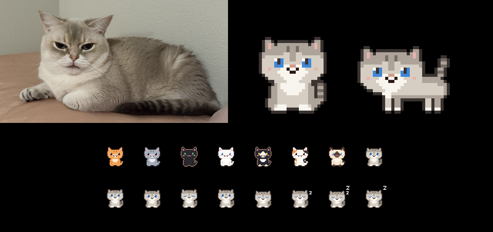

What makes this cat recognizable, and where each part lives:

- Coloring (`PetBreed.palette`): pale silver-beige fur, a taupe shade for the crown, back and flanks, a dark taupe accent for ticking and tail rings, a white muzzle, chin, chest and paws, a pink-tan nose, and clear blue eyes with white highlights.
- Head (`CatArt.headRound`): small rounded ears set wide apart, a taupe crown with faint ticking that runs down the forehead, and full cheeks around the white muzzle.
- Face (`CatArt.faceRound`): big, open 3x3 eyes (a blue iris around a tall dark pupil, with a white highlight in the top corner) and a small "u" smile under the nose.
  The maintainer asked for open, cute blue eyes rather than the photo's half-lidded look, so this is the one place the sprite departs from the reference.
- Body (`CatArt.bodyRound`, `WalkArt.roundCatTorso`, `WalkArt.roundCatTail`): taupe flanks and back with ticking, full haunches, and a thick tail ringed with dark bands.
  These grids have the same size as the plain cat's, so every costume fits without new art.

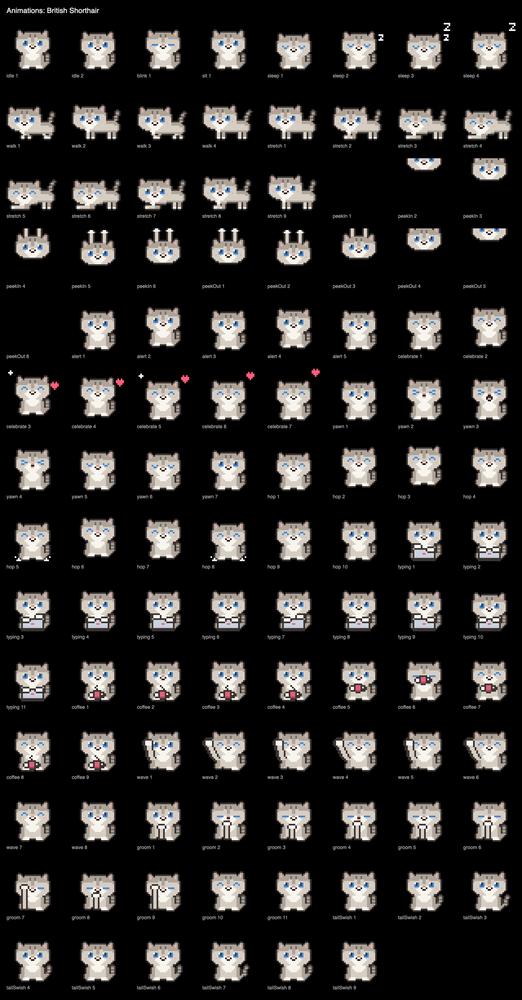

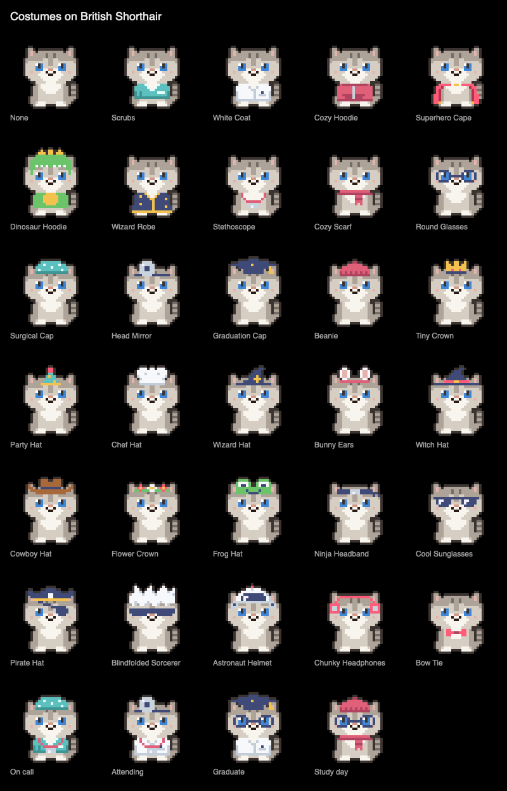

`PetProfile.defaultName(for:)` gives cats no name and dogs "Biscuit", and `hasDefaultName` tells these (and "Mochi", the starter name in earlier versions) apart from a name the user chose, so switching species only renames a pet that still has a default name.
A kit can still pick another starter (`moduleSettings.closet.pet`), and a pet that is already saved never changes.

### The Sphynx

The Sphynx is hairless, so its look comes from shape and shading instead of markings:

- Head (`CatArt.headSphynx`): big ears flaring out from a narrow crown with pink insides, short shade lines across the brow for wrinkles, and sharp cheekbones over a narrow muzzle.
- Face (`CatArt.faceSphynx`): large 3x3 lemon-shaped green eyes with a slit pupil and a white highlight, rosy cheeks, and a small "w" mouth.
- Body (`CatArt.bodySphynx`, `WalkArt.sphynxTorso`, `WalkArt.sphynxTail`): a lean chest with neck wrinkles, bony haunches, and a one-pixel whip tail.
- Coloring (`PetBreed.palette`): pink-beige skin, a deeper pink-tan for wrinkles, a lighter chest and muzzle, and a warm dark outline.

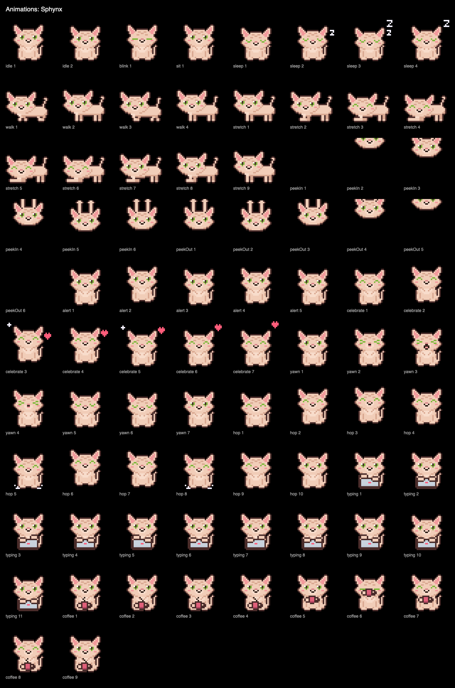

### The Poodle

The Poodle is all curls, so its look comes from a bumpy silhouette and dotted texture:

- Head (`DogArt.headPoodle`): a round topknot with a scalloped top and a shade line where it meets the forehead, a teddy face with a smooth cream muzzle, and long curly ears set apart from the face by an outline.
- Body (`DogArt.bodyPoodle`, `WalkArt.poodleTorso`): curls drawn as `furShade` and `furAccent` dots over the coat, a fluffy light chest, and pom bracelets around the paws.
- Tail (`DogArt.tailPom`, `WalkArt.poodleTail`): a short stem curving up to a round pom that stands clear of the haunch.
- Coloring (`PetBreed.palette`): apricot by default. The curls are `furShade` and `furAccent`, so a fur tint recolors the whole coat and keeps the texture.
- Hats sit on the shade line under the topknot (`skullTop` 4), so even the graduation cap stays inside the frame mid-hop.

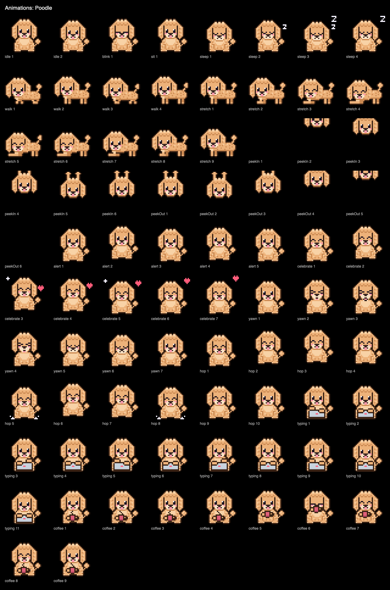

### The Shih Tzu

The Shih Tzu reads by its topknot, its flat face, and a coat that falls to the floor:

- Head (`DogArt.headShihTzu`): a gold topknot puff tied with a dark band, a white blaze between gold eye patches, a white beard that widens below the chin, and long gold ears that hang past it, set apart from the face by an outline.
- Face (`DogArt.faceShihTzu`): big round 3x3 eyes with a catchlight, a button nose right between them (the flat face), and the tip of a tongue.
- Body (`DogArt.bodyShihTzu`, `WalkArt.shihTzuTorso`): a long white coat drawn in `furShade` strands that flares out at the floor and hides all but the tips of the paws; walking, it ends in a fringe over the legs.
- Tail (`DogArt.tailPlume`, `WalkArt.shihTzuTail`): a plume curled up over the back with a gold tip.
- Coloring (`PetBreed.palette`): gold and white by default; the gold is `furAccent` on the ears, mask, and tail tip.
- The tie is drawn in the outline role, so a cap that covers the topknot never changes the face. Hats sit on the skull below it (`skullTop` 5).
- Party: the server catalog has no Shih Tzu, so it is sent as `pomeranian`, the nearest small long-coated breed there, and drawn back as a Shih Tzu.

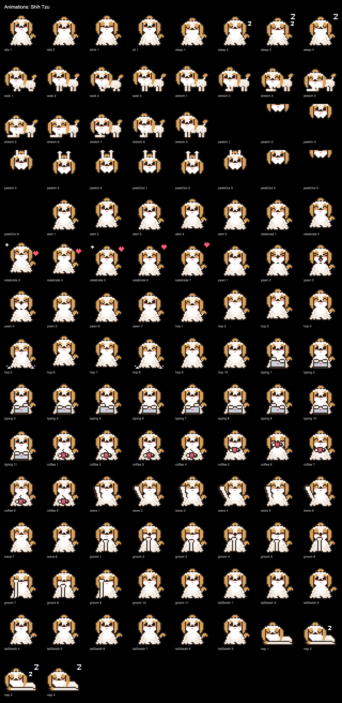

### Recoloring fur

`furAccent` means different things per breed: darker stripes on a tabby, lighter feathering on a golden's chest.
Setting fixed colors for every fur role would turn a golden's chest into a dark hole.
`PetPalette.furTint(_:)` takes one picked color instead.
It becomes `furBase`, and `furShade` and `furAccent` keep the picked hue and saturation while shifting lightness by as much as they differed from the breed's `furBase`.
Each breed keeps its own light and dark structure.
`furSpot` and `belly` are left alone, so tuxedo, calico, beagle, and corgi markings survive any tint.
Costume and knit colors are recolored per role with `setColor(_:for:)`.

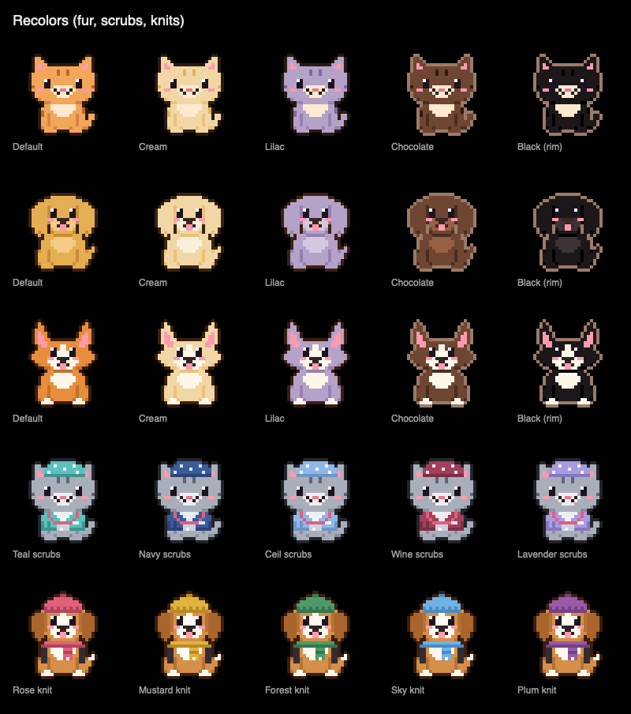

## Colors and visibility on black

`PetPalette` holds one color per role.
Breeds define a default palette; a pet profile applies user overrides on top with `applying(_:)`.
Always render through `withVisibleRim()`: when the fur is dark and the outline is too, the outline becomes a warm light rim (`PetPalette.warmRim`) so black and tuxedo cats never vanish on the black notch.
This also protects user recolors.

## Rendering

`PetRenderer` turns a canvas plus palette into a `CGImage`, writing every sprite pixel as an exact `scale`x`scale` block for crisp nearest-neighbor scaling.
`PetRenderer.shared` caches results, since an idle animation repeats a handful of frames.

## Body shapes

Breeds that share a silhouette share all of their art and differ only in palette and pattern.
Cats look alike enough that three shapes cover all nine breeds.
Dogs need more, because their ears and snouts are what make them recognizable at notch size:

| Shape | Breeds | What sets it apart |
| --- | --- | --- |
| `cat` | most cats | pointed ears, tabby stripe zones |
| `roundCat` | British Shorthair | small wide-set ears, round cheeks, big blue eyes, stocky body, ringed tail |
| `sphynxCat` | Sphynx | big flared ears, wrinkled brow and neck, lemon eyes, lean body, thin whip tail |
| `floppyDog` | Labrador, Beagle | hanging ears beside a rounded skull |
| `fluffyDog` | Golden Retriever | long feathered ears |
| `batEaredDog` | French Bulldog | big rounded bat ears, broad face |
| `pointyEaredDog` | Corgi | tall pointed ears, fox-like face |
| `longDog` | Dachshund | long snout and a long low body behind the head |
| `poodleDog` | Poodle | round curly topknot, long curly ears, dotted curl texture, pom tail |
| `shihTzuDog` | Shih Tzu | tied topknot, flat face with big round eyes, long ears and beard, floor-length coat |

Dog heads have different heights, so the shared dog face is stamped on each head's eye row.
The dog mouth is drawn in the nose color, not the outline, because on dark breeds the outline becomes a light rim that would look noisy on the muzzle.
`PetBreed.hasTail` leaves the tail off stubby-tailed breeds (Corgi, French Bulldog), which also sets their silhouettes apart.

## Adding a breed

1. Add a case to `PetBreed` with its `displayName`.
2. Pick a `bodyShape`. Reuse an existing one if the silhouette fits; add a new shape (and its art) only when ears, snout, or body need to differ to be recognizable at 24-32 pt.
3. Give it a `palette` with at least `furBase`, `furShade`, `furAccent`, and `belly`.
   Keep the outline dark for light fur; dark fur gets the warm rim automatically.
4. Map pattern zones in `pattern` to place its markings.
5. Run `swift test` and `swift run PetGallery /tmp/petgallery`, then review the sheet on black at 1x and 4x.
