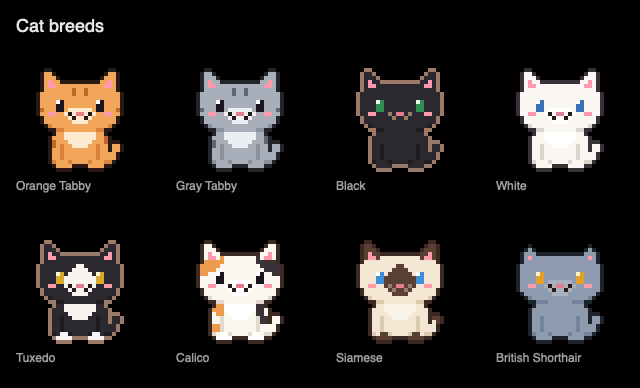
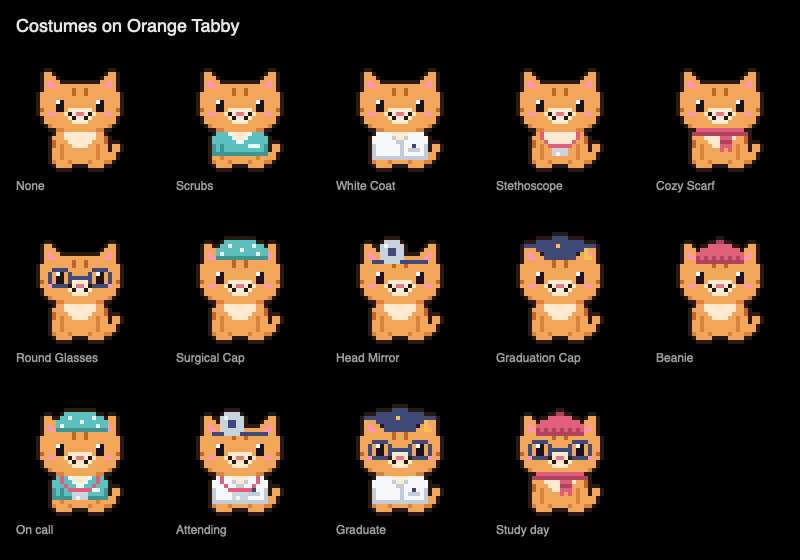
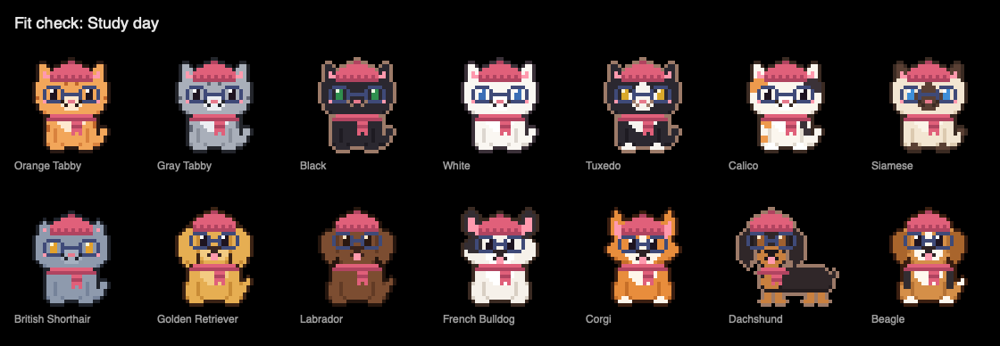

# StudyNotch pets

A study-buddy cat or dog lives in the notch.
This document explains how pet sprites are drawn, composed, and rendered, and how to add a breed.

Status: the sprite format, palettes, pattern zones, renderer, all eight cat breeds, all six dog breeds, and every costume (sitting pose) exist.
Animations are in progress.




## Look at the art

```sh
swift run PetGallery /tmp/petgallery   # writes contact sheets as PNGs at 4x
```

Sheets are drawn on pure black, exactly like the notch.
Do not commit the output folder; curated sheets live in `docs/studynotch/images/`.

## Sprite format

Art is plain text inside Swift string literals (`Sources/NotchDeckCore/Pets/Art/`).
Each character is one pixel.
A grid never stores a color, only what the pixel *means*; palettes turn meanings into colors.
That is what lets one drawing serve every breed, user recolor, and costume color.

```swift
static let ear = SpriteGrid(art: """
    .ee.
    ePPe
    eBBe
    """)
```

All rows of a grid must be the same width.
Parse errors report the 1-based row and column of the problem.

### Palette roles (uppercase)

| Symbol | Role | Used for |
| --- | --- | --- |
| `O` | outline | inner lines, mouth; outer outlines are automatic |
| `B` | furBase | main fur |
| `S` | furShade | shading, leg separation |
| `A` | furAccent | stripes, points |
| `K` | furSpot | second marking color (calico black) |
| `W` | belly | light fur |
| `E` | eye | pupils |
| `L` | eyeLight | eye highlight |
| `N` | nose | nose |
| `P` | blush | cheeks, inner ears |
| `C` | costumeBase | scrubs and the matching surgical cap |
| `D` | costumeShade | scrubs shading and hems |
| `T` | costumeTrim | V-neck piping, badge, cap dots |
| `U` | coat | white coat |
| `V` | coatShade | white coat seams and lapels |
| `G` | accessoryBase | scarf, beanie, stethoscope tubing |
| `J` | accessoryShade | knit shading and cuffs |
| `Q` | ink | graduation cap, glasses frames, head mirror band, pen |
| `Y` | gold | graduation tassel |
| `M` | metal | stethoscope chest piece, head mirror |
| `Z` | effect | sleep "z", sparkles, speech bubble |
| `H` | heart | celebration heart |

### Special cells

| Symbol | Meaning |
| --- | --- |
| `.` or space | transparent, lower layers show through |
| `x` | erase whatever lower layers painted here (a cap hiding ear tips) |

### Pattern zones (lowercase)

Shared body art marks regions whose color depends on the breed.
Each breed's `PetPattern` maps a zone to a palette role.
Unmapped zones fall back to their default.

| Symbol | Zone | Default |
| --- | --- | --- |
| `m` | muzzle | belly |
| `c` | chest | belly |
| `p` | paws | furBase |
| `t` | tailTip | furBase |
| `e` | ears | furBase |
| `f` | mask (center of the face) | furBase |
| `s` | stripes | furBase |
| `a` | patchA | furBase |
| `b` | patchB | furBase |

For example, the tuxedo maps paws, muzzle, chest, and mask to `belly`, and the Siamese maps ears, mask, muzzle, paws, and tail tip to `furAccent`.

## Composition

Every frame is a 32x32 canvas with the paws on the bottom row, so frames swap without jitter.
Layers are stamped in order, later layers painting over earlier ones:

1. body (shared per body shape)
2. pattern (the breed's zone map, applied while stamping)
3. face (eyes, nose, blush; swapped for blinks and expressions)
4. costume
5. accessory

After stamping, `PetCanvas.outlined()` adds a one-pixel outline around the whole silhouette using direct neighbors only, so corners stay round and every costume is outlined consistently.

## Costumes




A pet wears one `PetOutfit` (`none`, `scrubs`, `whiteCoat`) and accessories (`PetAccessory`).
Each accessory has a slot (neck, face, or head); a pet wears at most one per slot.
`PetAccessory.wearable(_:)` keeps the last item listed per slot and sorts them in drawing order, so hats always land on top.

Costume art lives in `Art/CostumeArt.swift` and is anchored to the pose layout instead of per-breed positions:

- Body items (outfits, stethoscope, scarf) have one grid per body family (cat, dog, long dog), the same size as that family's body and stamped at the same origin.
- Glasses have a cat and a dog grid, stamped one row above each head's eye row.
  Dog eyes sit close together, so the dog lenses are wider than the eyes; frames touching the pupils blur into them.
- Hats are 20 wide like every head.
  Each declares a `sitRow`, the grid row that lands on the head's `skullTop` (the row just below the top of the skull, so hats rest on the head instead of floating).

Colors come from dedicated roles so items never fight: scrubs and the surgical cap share the recolorable costume roles (a matching set), the white coat has its own roles so recolored scrubs never tint it, and knit items share the recolorable accessory roles.
Accessories are drawn after the face and before the automatic outline, so hats get the same rounded outline as the pet.



### Adding a costume item

1. Add a case to `PetOutfit` or `PetAccessory` (with its `slot` and `displayName`).
2. Draw it in `CostumeArt` using costume roles only: a `BodyItem` for each body family, or a `HeadItem` with its `sitRow`.
3. Map the case to its art in `PetComposer`.
4. Run `swift test` (the costume tests check every breed for clipping and covered eyes) and review `costumes-*.png` and `fit-*.png` from `PetGallery`.

## Colors and visibility on black

`PetPalette` holds one color per role.
Breeds define a default palette; a pet profile applies user overrides on top with `applying(_:)`.
Always render through `withVisibleRim()`: when the fur is dark and the outline is too, the outline becomes a warm light rim (`PetPalette.warmRim`) so black and tuxedo cats never vanish on the black notch.
This also protects user recolors.

## Rendering

`PetRenderer` turns a canvas plus palette into a `CGImage`, writing every sprite pixel as an exact `scale`x`scale` block for crisp nearest-neighbor scaling.
`PetRenderer.shared` caches results, since an idle animation repeats a handful of frames.

## Body shapes

Breeds that share a silhouette share all of their art and differ only in palette and pattern.
Cats look alike enough that two shapes cover all eight breeds.
Dogs need more, because their ears and snouts are what make them recognizable at notch size:

| Shape | Breeds | What sets it apart |
| --- | --- | --- |
| `cat` | most cats | pointed ears, tabby stripe zones |
| `roundCat` | British Shorthair | small wide-set ears, round cheeks |
| `floppyDog` | Labrador, Beagle | hanging ears beside a rounded skull |
| `fluffyDog` | Golden Retriever | long feathered ears |
| `batEaredDog` | French Bulldog | big rounded bat ears, broad face |
| `pointyEaredDog` | Corgi | tall pointed ears, fox-like face |
| `longDog` | Dachshund | long snout and a long low body behind the head |

Dog heads have different heights, so the shared dog face is stamped on each head's eye row.
The dog mouth is drawn in the nose color, not the outline, because on dark breeds the outline becomes a light rim that would look noisy on the muzzle.
`PetBreed.hasTail` leaves the tail off stubby-tailed breeds (Corgi, French Bulldog), which also sets their silhouettes apart.

## Adding a breed

1. Add a case to `PetBreed` with its `displayName`.
2. Pick a `bodyShape`. Reuse an existing one if the silhouette fits; add a new shape (and its art) only when ears, snout, or body need to differ to be recognizable at 24-32 pt.
3. Give it a `palette` with at least `furBase`, `furShade`, `furAccent`, and `belly`.
   Keep the outline dark for light fur; dark fur gets the warm rim automatically.
4. Map pattern zones in `pattern` to place its markings.
5. Run `swift test` and `swift run PetGallery /tmp/petgallery`, then review the sheet on black at 1x and 4x.
